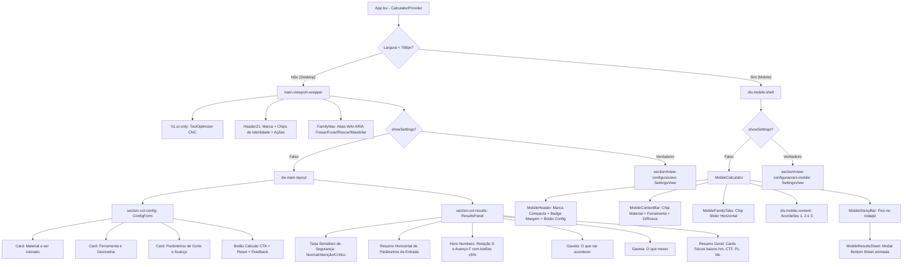
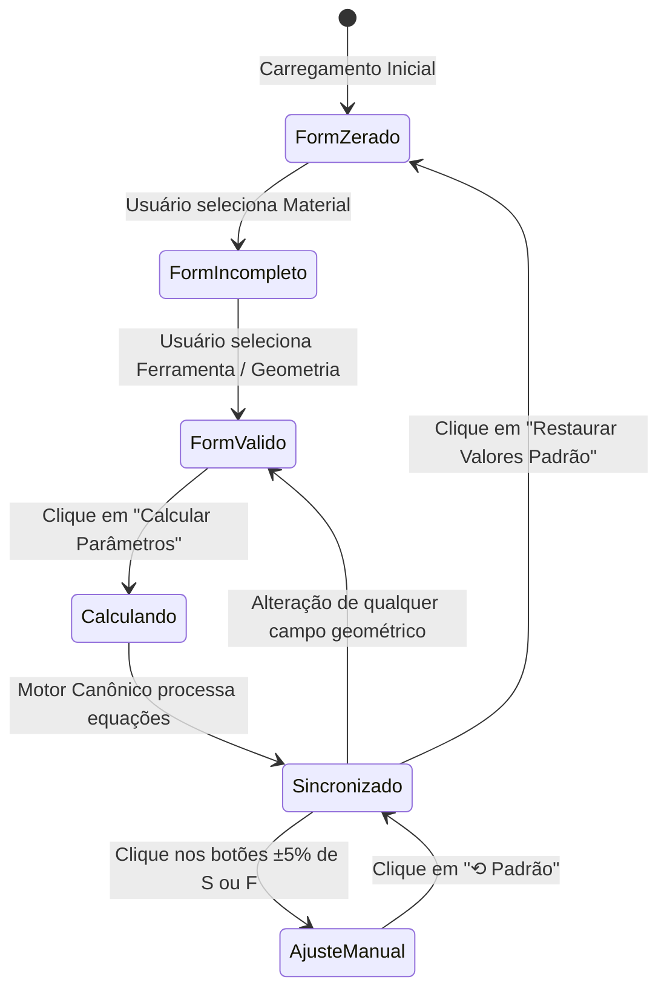

# Inventário Técnico e Visual do Produto: ToolOptimizer CNC (v2.0.0)

> **Documento de Referência Arquitetural, Visual e Funcional do Sistema em Produção**  
> **Data de Levantamento:** Março de 2026  
> **Status da Aplicação:** Online e Operacional em Produção (`https://app.tooloptimizercnc.com.br` e `https://tooloptimizercnc.com.br`)  
> **Autor da Auditoria:** Antigravity / DeepMind Pair Programming  
> **Propósito:** Permitir a qualquer engenheiro, designer ou agente reconstruir com fidelidade cirúrgica a interface, seus componentes, interações, física e conceber a futura página de apresentação, vendas e download.

---

## Sumário Executivo

O **ToolOptimizer CNC v2.0.0** é uma Progressive Web App (PWA) offline-first de cálculo e validação de parâmetros de corte para máquinas-ferramenta CNC (fresamento, furação, roscamento e mandrilamento). A aplicação não requer autenticação, não possui backend tradicional de processamento e executa todo o cálculo físico analítico via motor canônico fundamentado nas equações de Kienzle ($kc_{1.1}, mc$) diretamente no cliente (client-side), persistindo configurações e ferramentas locais no IndexedDB (`tooloptimizer_db`).

A investigação realizada cobriu duas perspectivas:
1. **O que existe no código-fonte:** Repositório `ToolOptimizerCNC` (TypeScript puro no motor `/src/core`, React 19 na camada `/src/ui`, 114 testes unitários automatizados passando com 100% de sucesso).
2. **O que efetivamente aparece e acontece na aplicação em produção:** Servida via Cloudflare Workers / Static Assets SPA nos domínios públicos oficiais, com comportamento responsivo bifurcado entre Desktop (`viewport-wrapper`) e Mobile (`mobile-shell`).

---

## 1. Estrutura Geral da Interface

A aplicação é uma Single Page Application (SPA) estruturada hierarquicamente em container único (`.tool-app`), com renderização condicional baseada na largura de tela através do hook `useIsMobile(768)`:
- **Telas $\ge$ 768px (Desktop & Tablets amplos):** Apresenta layout clássico de dashboard com cabeçalho superior (`HeaderZ1`), barra de navegação por abas de famílias de usinagem (`FamilyNav`), e divisão em duas colunas verticais paralelas sincronizadas (`.col-config` à esquerda para entradas e `.col-results` à direita para telemetria e diagnósticos).
- **Telas < 768px (Smartphones & Mobile):** Apresenta experiência móvel dedicada (`MobileCalculator`), composta por cabeçalho compacto fixo (`MobileHeader`), barra horizontal deslizante de abas (`MobileFamilyTabs`), área de cartões sanfonados verticais (`.mobile-content`) e barra fixa inferior de telemetria (`MobileStickyBar`) que aciona uma folha modal deslizante de baixo para cima (`MobileResultsSheet`).
- **Tela de Configurações Gerais (`SettingsView`):** Exibida em overlay/substituição de tela inteira tanto no Desktop quanto no Mobile ao clicar no botão "Configurações", ocultando o painel de cálculo ativo.



---

## 2. Inventário de Componentes Visuais

| Componente | Localização | Função | Características Desktop | Características Mobile | Estados Visuais | Origem |
|---|---|---|---|---|---|---|
| **Brand Plate** | `HeaderZ1` / `MobileHeader` | Identidade visual da marca | Badge com logotipo SVG (fresa/engrenagem estilizada neon), texto `TOOLOPTIMIZER` em 800 weight, raio 4px. No tema escuro: borda ciano neon `#19E4BB` com `box-shadow: 0 0 16px rgba(25,228,187,0.35)`. | Versão compacta com padding 6px 10px, fonte 13px. | Default, Hover (brilho ciano intensificado). | CONFIRMADO NO CÓDIGO E NA INTERFACE |
| **Identity Chips (`.z1-chip`)** | `HeaderZ1` (Desktop) | Exibir resumo dinâmico do material, ferramenta e dimensões ativas | Fundo `var(--surface-card-subtle)`, borda sutil, rótulo uppercase em 10px seguido pelo valor nominal em 12px semi-bold. Badge ISO cinza. | Ocultado no topo; condensado na `.mobile-context-bar` abaixo do cabeçalho. | Vazio (exibe traço "—"), Preenchido. | CONFIRMADO NO CÓDIGO E NA INTERFACE |
| **Theme Switcher** | `HeaderZ1` / `MobileHeader` | Alternar entre tema Claro (operacional) e Escuro (Titanium Obsidian) | Botão `.hbtn` com ícone SVG de sol/lua e texto ("Claro" / "Escuro"). | Botão de ícone compacto no cabeçalho. | Claro, Escuro, Hover, Focus-visible. | CONFIRMADO NO CÓDIGO E NA INTERFACE |
| **External Links** | `HeaderZ1` (Desktop) | Acesso direto às páginas institucionais e design system | Dois botões `.hbtn`: "Site Modelo ↗" (leva a `/site-model.html`) e "Design System ↗" (leva a `/showcase.html`). | Ocultados na visualização móvel para economizar espaço de tela. | Default, Hover (borda e texto ciano neon). | CONFIRMADO NO CÓDIGO E NA INTERFACE |
| **Family Tabs (`.nav-tab`)** | `FamilyNav` | Seleção do processo de usinagem (Fresar, Furar, Roscar, Mandrilar) | Grid de 4 colunas em container arredondado (raio 14px), altura 44px, ícone SVG 18x18 + texto 13px 700 weight. Roving tabindex WAI-ARIA. | Slider horizontal com scroll sem barra visível (`.mobile-tab-item`), altura mínima 42px. | Default, Hover, Ativa (`background: rgba(25,228,187,0.16)`, texto e ícone ciano neon, sombra sutil), Focus. | CONFIRMADO NO CÓDIGO E NA INTERFACE |
| **Stepper Input (`.sctl`)** | `ConfigForm` / `SettingsView` | Entrada de dados numéricos com ajuste fino por botões de passo | Caixa contendo botão `−` à esquerda (44x44px), campo input centralizado monospaçado (`JetBrains Mono`), sufixo de unidade (`mm`, `m/min`, etc.) e botão `+` à direita (44x44px). | Ocupa 100% da largura do card móvel, mantendo alvos de toque de 44px mínimos. | Default, Focus-within (borda ciano e anel de foco 3px), Digitação livre (com vírgula ou ponto decimal), Inválido. | CONFIRMADO NO CÓDIGO E NA INTERFACE |
| **Educational Drawer (`.drawer`)** | `ConfigForm` / `ResultsPanel` / `SettingsView` | Explicar fisicamente a função de parâmetros (D11, Z5, Z6) | Barra com seta expansível (chevron com rotação 90° ao abrir), texto "o que X faz" em itálico/subtle. Corpo exibe seções em prosa: "O que é", "▲ aumentar", "▼ diminuir", "Equilíbrio". | Sanfona nativa adaptada à largura estreita, padding 10px. | Fechado (default), Aberto (animado via transição CSS). | CONFIRMADO NO CÓDIGO E NA INTERFACE |
| **Botão Calcular CTA (`#btn-calcular`)** | `ConfigForm` / `MobileStickyBar` | Execução analítica da cadeia de corte e sincronização | Botão proeminente de 52px de altura, fundo lime elétrico `#BDFF4B`, texto `#070F02` em 800 weight, sombra neon intensa. Ícone de engrenagem/relógio. | Exibido na barra fixa inferior (`MobileStickyBar`) enquanto o cálculo não foi executado. | Desabilitado (`opacity: 0.45`), Habilitado (pronto), Calculado/Sincronizado (fundo ciano translúcido com checkmark). | CONFIRMADO NO CÓDIGO E NA INTERFACE |
| **Safety Band (`.alert-band`)** | `ResultsPanel` / `MobileResultsSheet` | Semáforo de segurança física e integridade do corte (Z2) | Faixa horizontal com chip de segurança à esquerda ("NORMAL", "ATENÇÃO", "CRÍTICO"), título do alerta em 13px 600 weight e texto explicativo em prosa técnica. | Exibida no topo da folha de resultados móvel. | Normal (verde `#00E5A3`), Atenção (âmbar `#FFB020`), Crítico (vermelho `#FF4D4D`). | CONFIRMADO NO CÓDIGO E NA INTERFACE |
| **Hero Card Rotação (`[data-hero="s"]`)** | `ResultsPanel` / `MobileResultsSheet` | Exibição de comando principal de rotação do fuso ($S / n$) | Card de destaque com badge "S", título "Rotação do fuso (n)", botões de ajuste `−` e `+` (±5%), número em 38px mono (`.rbig`), unidade "rpm". Linha inferior de reversão "⟲ Padrão" quando alterado. | Integrado em layout vertical na folha modal móvel. | Calculado, Em Edição Manual (borda destacada e tag "ajuste ±X%"), Desabilitado. | CONFIRMADO NO CÓDIGO E NA INTERFACE |
| **Hero Card Avanço (`[data-hero="f"]`)** | `ResultsPanel` / `MobileResultsSheet` | Exibição de comando principal de avanço da mesa ($F / v_f$) | Card de destaque com badge "F", título "Velocidade de avanço (vf)", botões de ajuste `−` e `+` (±5%), número em 38px mono, unidade "mm/min". Em roscamento: botões ocultados e tag "Rosqueamento Sincronizado". | Integrado em layout vertical na folha modal móvel. | Calculado, Em Edição Manual, Roscamento Travado (sem ajuste manual). | CONFIRMADO NO CÓDIGO E NA INTERFACE |
| **Z7 Physical Summary Cards** | `ResultsPanel` / `MobileResultsSheet` | Cartões compactos de telemetria física analítica | Grid de cartões compactos com rótulo técnico uppercase (11px) e valor em 20px mono (`.u20`). Exibe $h_m$, $h_{ex}$, $CTF$, $L/D$, $k_c$, $MRR/Q$, $v_c$ real, $P_c$ e $M_c$. | Grid de 2 colunas (`.mobile-z7-grid`) dentro da folha modal móvel. | Normal, Alerta (valor em âmbar com tag "ATENÇÃO" quando $L/D > 4$). | CONFIRMADO NO CÓDIGO E NA INTERFACE |
| **Mobile Sticky Bar** | `MobileStickyBar` | Barra fixa no rodapé para controle e visualização em trânsito | Não existe em desktop. | Fixada em `bottom: 0`, altura aproximada 64px, safe-area inset bottom. Exibe botão Calcular CTA (se não calculado) ou resumo de $S$, $F$, chip de segurança e botão "Detalhes" (se calculado). | Aguardando cálculo, Calculado / Sincronizado. | CONFIRMADO NO CÓDIGO E NA INTERFACE |
| **Mobile Results Sheet** | `MobileResultsSheet` | Folha modal deslizante com resultados completos | Não existe em desktop. | Overlay translúcido preto (`rgba(0,0,0,0.55)`), painel branco/dark com raio superior 16px, barra de arraste (drag handle), altura máxima de 88vh, botão fechar circular. | Fechado (desmontado), Aberto (animações `fadeIn` e `slideUp`). | CONFIRMADO NO CÓDIGO E NA INTERFACE |
| **Settings Modal / View** | `SettingsView` | Painel de configuração geral do sistema e persistência | Ocupa toda a viewport do container (`max-width: 1100px`), cabeçalho com botão "Voltar ao cálculo", aviso do fornecedor, lista de materiais, ferramentas da oficina, margem de segurança global e parâmetros HSS. | Adaptado com scroll vertical contínuo e botões expandidos para touch. | Default, Modo Edição, Modo Criação, Modal de Confirmação de Deleção. | CONFIRMADO NO CÓDIGO E NA INTERFACE |

---

## 3. Elementos Interativos e Mapeamento de Estados

A aplicação segue o padrão de máquina de estados estrita: toda interação visual gera uma resposta de transição imediata e uma mutação de estado no `CalculatorContext`.



### Mapeamento Ação $\rightarrow$ Resposta $\rightarrow$ Estado $\rightarrow$ Resultado

1. **Seleção de Material no Select (`#select-material`):**
   - *Ação:* Operador escolhe um material (ex: "Aço 1045").
   - *Resposta Visual:* O select preenche o valor; a seção "Dados do Material" é preenchida instantaneamente com Classe ISO, Dureza estimada, $k_{c1.1}$, $m_c$ e $v_c$ de partida; o chip no cabeçalho Z1 atualiza.
   - *Alteração de Estado:* `selectedMaterial` atualizado no contexto; recalcula automaticamente `canCalculate`.
   - *Resultado:* Se a ferramenta já estiver selecionada, o botão "Calcular Parâmetros" é habilitado com transição de cor para lime vibrante.

2. **Seleção de Ferramenta (`#select-tool`):**
   - *Ação:* Operador escolhe a geometria (ex: "Toroidal (MD)").
   - *Resposta Visual:* Campos geométricos adaptativos aparecem (ex: raio de canto $r$ surge condicionalmente); valores padrão de partida são pré-carregados.
   - *Alteração de Estado:* `selectedTool`, `selectedSubstrate`, e `currentInputs` são preenchidos com os valores de fábrica daquela ferramenta.
   - *Resultado:* `canCalculate` passa a `true`.

3. **Digitação Livre com Teclado nos Campos Numéricos (`StepperInput`):**
   - *Ação:* Operador digita valor decimal usando ponto (`0.2`) ou vírgula (`0,2`).
   - *Resposta Visual:* Nenhum caractere é bloqueado ou formatado abruptamente durante a digitação; a borda do campo ganha realce ciano neon e anel de foco.
   - *Alteração de Estado:* O estado local `localText` mantém o texto bruto digitado; no evento `blur`, o valor é normalizado e emitido ao contexto (`updateField`).
   - *Resultado:* Permite digitação natural e fluida sem perda de foco.

4. **Incremento / Decremento nos Steppers (`−` / `+`):**
   - *Ação:* Operador clica nos botões laterais do campo numérico.
   - *Resposta Visual:* O botão tem feedback tátil de clique (`:active` com mudança de fundo); o valor avança no incremento definido (ex: $D$ em 1 mm, $ap$ em 0.1 mm, $fz$ em 0.005 mm).
   - *Alteração de Estado:* `currentInputs[campo]` é recalculado com controle estrito de ponto flutuante (`toFixed`).
   - *Resultado:* Se o sistema já estiver calculado, o estado de sincronismo é desmarcado até novo clique de cálculo.

5. **Clique em "Calcular Parâmetros" (`#btn-calcular`):**
   - *Ação:* Operador clica no botão principal de CTA.
   - *Resposta Visual:* Botão transiciona para estado `is-calculated` (fundo ciano translúcido com checkmark e texto "Parâmetros Atualizados"); a tarja de status muda para "Parâmetros de corte calculados e em dia"; os Hero Numbers $S$ e $F$ e os cartões Z7 são populados em menos de 10 milissegundos.
   - *Alteração de Estado:* `isCalculated = true`; `millingResult` (ou da família ativa) armazena o objeto de cálculo; `sOffsetPercent = 0`; `fOffsetPercent = 0`.
   - *Resultado:* Em mobile, a folha modal de resultados abre automaticamente na primeira execução.

6. **Ajuste Fino Bidirecional de Rotação ou Avanço (Botões ±5% em Z4):**
   - *Ação:* Operador clica no botão `+` do cartão Herói $S$.
   - *Resposta Visual:* O número de rotação aumenta 5%; uma tag azul "ajuste +5 %" surge no topo do cartão; a linha inferior surge com o texto "calculado [valor nominal] rpm" e o botão "⟲ Padrão".
   - *Alteração de Estado:* `sOffsetPercent` recebe +5; o motor canônico recalcula a velocidade de corte real e o avanço mantendo o torque e o avanço por dente coerentes.
   - *Resultado:* O operador testa variações no chão de fábrica sem perder a referência nominal de engenharia.

7. **Clique no Botão de Alternância de Tema:**
   - *Ação:* Clique no botão no canto superior direito.
   - *Resposta Visual:* Transição imediata de toda a paleta da página entre Claro (fundo `#F4F6F9`, cartões `#FFFFFF`) e Escuro (fundo `#080C12`, cartões `#131B29`, realces em `#19E4BB` neon).
   - *Alteração de Estado:* Atributo `data-theme` alternado na tag `<html>` e `<body>`; persistido no `localStorage.setItem('to_theme', next)`.
   - *Resultado:* Permite leitura em ambientes sob sol intenso ou cabines escuras de usinagem.

---

## 4. Calculadora: Entradas, Saídas, Fórmulas e Regras Físicas

### 4.1 Entradas por Família de Usinagem

| Família | Campo | Símbolo | Unidade | Valor Partida Padrão | Passo Stepper | Validação / Condição de Exibição |
|---|---|---|---|---|---|---|
| **Todas** | Material | — | — | Não selecionado | — | Obrigatório para cálculo. |
| **Todas** | Ferramenta | — | — | Não selecionada | — | Obrigatório para cálculo. |
| **Fresar** | Diâmetro nominal | $D$ | mm | Vazio (sugestão: 10) | 1 mm | Obrigatório ($D > 0$). |
| **Fresar** | Raio de canto | $r$ | mm | 1.0 mm | 0.5 mm | Exibido apenas se a ferramenta pedir `r` (Toroidal). |
| **Fresar** | Ângulo de posição | $\kappa$ | graus | 15° ou 45° | 5° | Exibido se pedir `kappa` (Alto Avanço, Cabeçote Faceador). |
| **Fresar** | Diâmetro menor | $D_{min}$ | mm | 2.0 mm | 1 mm | Exibido se pedir `Dmin` (Fresa de Chanfrar). |
| **Fresar** | Número de arestas | $Z$ | dentes | 4 (ou 2 / 5 conforme ferramenta) | 1 dente | Inteiro $\ge 1$. |
| **Fresar** | Balanço | $L$ | mm | 30 mm | 5 mm | Obrigatório ($L > 0$). Relação $L/D$ gera alertas se $> 4$. |
| **Fresar** | Profundidade de corte | $a_p$ | mm | 3.00 mm | 0.1 mm | Obrigatório. Não pode exceder o comprimento de corte útil. |
| **Fresar** | Engajamento radial | $a_e$ | mm | 5.00 mm | 0.1 mm | Obrigatório ($a_e \le D$). Dispara correção $CTF$ se $a_e < 0.5 D$. |
| **Fresar** | Velocidade de corte | $v_c$ | m/min | Herdado do material (ex: 140) | 5 m/min | Obrigatório ($v_c > 0$). |
| **Fresar** | Avanço por dente | $f_z$ | mm/dente | Interpolado por $D$ (ex: 0.060) | 0.005 mm | Obrigatório ($f_z > 0$). |
| **Furar** | Diâmetro da broca | $D$ | mm | Vazio (sugestão: 10) | 1 mm | Obrigatório. Valida diâmetro mínimo/máximo pelo substrato. |
| **Furar** | Ângulo de ponta | $\sigma$ | graus | 118° (HSS) ou 140° (MD) | 5° | Geometria da ponta da broca. |
| **Furar** | Balanço | $L$ | mm | 50 mm | 5 mm | Relação $L/D$ valida profundidade do furo e pica-pau. |
| **Furar** | Velocidade de corte | $v_c$ | m/min | 16 (HSS) ou herdado MD | 2 m/min | Broca de aço rápido trabalha em velocidade reduzida. |
| **Furar** | Avanço por rotação | $f_n$ | mm/rot | 0.10 mm/rot | 0.02 mm | Em HSS é vinculado a `% da rotação` na configuração. |
| **Roscar** | Diâmetro nominal | $D$ | mm | Vazio (ex: 8) | 1 mm | Define a rosca métrica ($M_D$). |
| **Roscar** | Passo da rosca | $P$ | mm | 1.25 mm | 0.25 mm | Passo nominal métrico. Trava a relação $F = S \times P$. |
| **Roscar** | Balanço | $L$ | mm | 30 mm | 5 mm | Relação $L/D$ monitorada contra flambagem do macho. |
| **Roscar** | Velocidade de corte | $v_c$ | m/min | 14 m/min | 2 m/min | Teto físico de segurança em 40 m/min (corte) e 60 m/min (conformação). |
| **Mandrilar** | Diâmetro inicial | $D_i$ | mm | 18 mm | 1 mm | Diâmetro pré-existente do furo antes do passe. |
| **Mandrilar** | Diâmetro final | $D_f$ | mm | 20 mm | 1 mm | Cota final do furo. $a_p$ derivado = $(D_f - D_i) / 2$. |
| **Mandrilar** | Raio de ponta | $r_\varepsilon$ | mm | 0.4 mm | 0.2 mm | Raio de ponta da pastilha de mandrilamento. |
| **Mandrilar** | Balanço da barra | $L$ | mm | 60 mm | 5 mm | Crítico para rigidez estática e deflexão da barra. |
| **Mandrilar** | Velocidade de corte | $v_c$ | m/min | 140 m/min | 5 m/min | Avaliada na periferia do diâmetro final $D_f$. |
| **Mandrilar** | Avanço por rotação | $f_n$ | mm/rot | 0.08 mm/rot | 0.01 mm | Faixa canônica estreita (0.04–0.12 mm/rot). |

### 4.2 Saídas Calculadas e Exibidas

- **Hero Numbers (Comandos CNC Principais):**
  - $S$ (Rotação do Fuso): $\text{rpm}$, fórmula canônica $n = \frac{v_c \times 1000}{\pi \times D}$.
  - $F$ (Velocidade de Avanço): $\text{mm/min}$, fórmula canônica $v_f = n \times Z \times f_z$ (fresamento) ou $v_f = n \times f_n$ (furação/mandrilamento) ou $v_f = n \times P$ (roscamento sincronizado).
  - $Q$ (Passo Pica-pau, exclusivo de furação): $\text{mm}$, incremento seguro calculado $Q = \min(D / 25, 0.8\text{ mm})$.
- **Grandezas Físicas Canônicas (Painel Z7):**
  - Espessura média do cavaco ($h_m$): em mm.
  - Espessura máxima do cavaco ($h_{ex}$): em mm.
  - Fator de afinamento de cavaco ($CTF$): multiplicador adimensional ($\times$).
  - Relação Balanço/Diâmetro ($L/D$): dimensional de esbeltez.
  - Força específica de corte instantânea ($k_c$): em $\text{N/mm}^2$ pelo modelo de Kienzle: $k_c = k_{c1.1} \times h_m^{-m_c}$.
  - Taxa de remoção de material ($MRR$ ou $Q$): em $\text{cm}^3/\text{min}$.
  - Velocidade de corte real na aresta ($v_c$): em $\text{m/min}$.
  - Potência de corte líquida na aresta ($P_c$): em $\text{kW}$, fórmula canônica $P_c = \frac{Q \times k_c}{60000 \times \eta}$.
  - Torque na árvore ($M_c$): em $\text{N}\cdot\text{m}$, fórmula canônica $M_c = \frac{P_c \times 9550}{n}$.
- **Semáforo de Segurança (Precedência Canônica):**
  - **NORMAL (Verde):** Operação estável, $L/D \le 4$, potência dentro do limite, sem risco de colapso.
  - **ATENÇÃO (Âmbar):** Balanço longo ($4 < L/D \le 6$), risco moderado de vibração harmônica, afinamento acentuado de cavaco. Recomenda redução de $a_e$ ou avanço.
  - **CRÍTICO (Vermelho):** Balanço extremo ($L/D > 6$), potência requerida extrapolando teto padrão, velocidade de corte de macho excedendo 40 m/min, risco iminente de quebra de ferramenta.

---

## 5. Responsividade: Mobile × Desktop

### 5.1 Especificação Desktop ($\ge 768\text{px}$)

- **Container Principal:** `#viewport-container.viewport-wrapper`, largura máxima de 1440px (centralizado via `margin: 0 auto`), padding `16px 24px 80px`.
- **Grid de Layout (`.main-layout`):** `display: flex`, direção horizontal, gap de 24px.
- **Distribuição de Colunas:**
  - Coluna de Configurações (`.col-config`): `flex: 1 1 520px; max-width: 580px;`.
  - Coluna de Resultados (`.col-results`): `flex: 1 1 600px; min-width: 480px; position: sticky; top: 16px;`.
- **Hierarquia Visual:** Navegação superior limpa, dados de montagem e variáveis geométricas na esquerda; hero numbers gigantes com semáforo de segurança e cartões analíticos fixos à direita durante o scroll.
- **Navegação de Famílias:** 4 abas alinhadas horizontalmente em uma barra única (`grid-template-columns: repeat(4, 1fr)`).

### 5.2 Especificação Mobile ($< 768\text{px}$)

- **Container Dedicado:** `.mobile-shell`, largura 100%, altura mínima `100dvh`, sem padding lateral no invólucro para encostar nas bordas da tela.
- **Cabeçalho Compacto:** `.mobile-header` colado no topo (`position: sticky; top: 0; z-index: 80;`), altura cerca de 48px, composto pela marca, badge de margem e botão de configurações (38x38px). Logo abaixo, a `.mobile-context-bar` rola horizontalmente exibindo os chips de Material, Ferramenta e Diâmetro.
- **Navegação de Famílias:** Chip slider horizontal (`.mobile-family-list`) com rolagem suave por toque (`-webkit-overflow-scrolling: touch; scrollbar-width: none;`).
- **Formulários:** Cartões sanfonados verticais de bloco único (`.mobile-card`), com botões acordeão que expandem/recolhem as seções "1. Material", "2. Ferramenta" e "3. Parâmetros". Inputs com altura de toque de 44px e fonte legível para evitar zoom automático no iOS (`font-size: 16px` implícito no input focus).
- **Barra Fixa no Rodapé (`.mobile-sticky-bar`):** `position: fixed; bottom: 0; z-index: 90;`, com preenchimento da área segura inferior (`env(safe-area-inset-bottom)`). Permite que o operador acione o cálculo com o polegar sem precisar rolar até o fim do formulário.
- **Folha de Resultados Modal (`.mobile-sheet-content`):** Desliza de baixo para cima (`slideUp 0.2s`), ocupando até 88% da altura da tela (`max-height: 88vh`). Possui puxador superior (drag handle), botão de fechar (30x30px) e rolagem interna independente para os Hero Cards, semáforo e grid Z7 de 2 colunas.

### 5.3 Breakpoints Exatos do Código

| Breakpoint | Regra CSS | Comportamento no Sistema | Origem |
|---|---|---|---|
| **768px** | `useIsMobile(768)` (TypeScript / React) | **Ponto de bifurcação arquitetural:** Comuta a árvore de renderização do React entre a casca Desktop (`viewport-wrapper`) e a casca Mobile (`mobile-shell`). | CONFIRMADO NO CÓDIGO |
| **1080px** | `@media (max-width: 1080px)` (CSS) | Transforma o `.main-layout` desktop de flex horizontal em vertical (`flex-direction: column`). As colunas passam a ocupar 100% da largura. | CONFIRMADO NO CÓDIGO |
| **720px** | `@media (max-width: 720px)` (CSS) | Transforma o seletor de famílias `.nav-families` em grid de 2x2 colunas (`repeat(2, 1fr)`). | CONFIRMADO NO CÓDIGO |
| **600px** | `@media (max-width: 600px)` (CSS) | Reduz o padding do container para 12px; transforma `.vgrid` e `.mgrid` em coluna única (1fr); empilha o cabeçalho Z1 verticalmente. | CONFIRMADO NO CÓDIGO |

---

## 6. Design System Visual (Tokens Canônicos)

A aplicação opera com dois temas exatos auditados com contraste estrito WCAG AA ($> 4.5:1$ para texto regular e $> 3:1$ para controles e textos grandes).

```
PALETA DE CORES (AMOSTRAS HEX):
[#0F766E] Ciano Petróleo Industrial (Marca Light)
[#19E4BB] Ciano Cirúrgico Neon (Marca Dark)
[#3F700B] Oliva Técnico de Ação (Ação Light)
[#BDFF4B] Lime Elétrico Fluorescente (Ação Dark)
[#080C12] Dark Titanium Obsidian (Fundo Dark)
[#F4F6F9] Cinza Claro Técnico (Fundo Light)
[#00E5A3] Verde Esmeralda (Status Normal)
[#FFB020] Âmbar Ouro Industrial (Status Atenção)
[#FF4D4D] Vermelho Rubi (Status Crítico)
```

### Tabela de Tokens e Variáveis CSS

| Categoria | Token CSS | Tema Claro (Default) | Tema Escuro (Titanium) | Finalidade de Uso |
|---|---|---|---|---|
| **Fundos** | `--bg-page` | `#F4F6F9` | `#080C12` | Fundo geral da página e viewport |
| **Fundos** | `--surface-card` | `#FFFFFF` | `#131B29` | Cartões e painéis de elevação principal |
| **Fundos** | `--surface-card-subtle` | `#F8FAFC` | `#182234` | Sub-blocos, chips de dados e fundos secundários |
| **Fundos** | `--surface-input` | `#FFFFFF` | `#0E141F` | Fundo de caixas de entrada de texto e select |
| **Bordas** | `--border-subtle` | `#E2E8F0` | `rgba(255, 255, 255, 0.08)` | Divisores e bordas de baixo contraste |
| **Bordas** | `--border-control` | `#CBD5E1` | `rgba(255, 255, 255, 0.16)` | Contornos de botões, steppers e campos |
| **Bordas** | `--border-control-focus` | `#0F766E` | `#19E4BB` | Realce visual de foco ativo no controle |
| **Tipografia** | `--tx-1` | `#0F172A` | `#FFFFFF` | Títulos, hero numbers e texto primário |
| **Tipografia** | `--tx-2` | `#334155` | `#C7D3E3` | Texto corrido, prosa e valores normais |
| **Tipografia** | `--tx-3` | `#64748B` | `#8E9FB8` | Rótulos (labels), unidades e texto secundário |
| **Marca** | `--brand-fill` | `#0F766E` | `#19E4BB` | Identidade primária, realces, ícones ativos |
| **Ação (CTA)** | `--action-fill` | `#3F700B` | `#BDFF4B` | Botão Calcular principal e ações prioritárias |
| **Ação (CTA)** | `--tx-on-action` | `#FFFFFF` | `#070F02` | Contraste de texto sobre o botão de ação |
| **Status** | `--st-normal-ink` | `#166534` | `#00E5A3` | Texto do nível de segurança NORMAL |
| **Status** | `--st-normal-bg` | `#DCFCE7` | `rgba(0, 229, 163, 0.12)` | Fundo da tarja de segurança NORMAL |
| **Status** | `--st-warn-ink` | `#854D0E` | `#FFB020` | Texto do nível de segurança ATENÇÃO |
| **Status** | `--st-warn-bg` | `#FEF9C3` | `rgba(255, 176, 32, 0.12)` | Fundo da tarja de segurança ATENÇÃO |
| **Status** | `--st-crit-ink` | `#991B1B` | `#FF4D4D` | Texto do nível de segurança CRÍTICO |
| **Status** | `--st-crit-bg` | `#FEE2E2` | `rgba(255, 77, 77, 0.14)` | Fundo da tarja de segurança CRÍTICO |
| **Fontes** | `--font-sans` | `'Urbanist', sans-serif` | `'Urbanist', sans-serif` | Tipografia estrutural geométrica |
| **Fontes** | `--font-mono` | `'JetBrains Mono', monospace` | `'JetBrains Mono', monospace` | Números, valores tabulares e códigos CNC |
| **Espaçamentos** | `--sp-1` a `--sp-7` | `4px`, `8px`, `12px`, `16px`, `24px`, `32px`, `48px` | Idem | Escala modular técnica |
| **Raios** | `--r-chip` / `--r-field` / `--r-card` | `6px` / `8px` / `14px` | Idem | Raios de cantos ergonômicos |
| **Toque** | `--h-target` / `--h-cta` | `44px` / `52px` | Idem | Alvos de toque industriais para luvas/dedo |

---

## 7. Imagens e Assets

| Asset | Tipo | Uso / Finalidade | Dimensão / Formato | Responsividade | Origem |
|---|---|---|---|---|---|
| **Logo ToolOptimizer (SVG)** | SVG Inline | Ícone do cabeçalho da marca (fresa em arco com rastro neon) | $22 \times 22\text{px}$ (viewBox $0\ 0\ 500\ 500$) | Vetorial contínuo, escala sem perda | CONFIRMADO NO CÓDIGO E NA INTERFACE |
| **Logo ToolOptimizer Master** | Imagem PNG | Identidade principal do repositório (`Logo_ToolOptimizer.png`) | $1024 \times 1024\text{px}$, 1.2 MB | Usado como fonte master dos ícones | CONFIRMADO NO CÓDIGO |
| **Favicon ICO** | Ícone | Aba do navegador (`/favicon.ico`) | Multi-resolução ($16, 32, 48\text{px}$) | Adaptado ao browser | CONFIRMADO NO CÓDIGO E NA INTERFACE |
| **Favicon PNGs** | Imagens PNG | Ativos públicos (`favicon-16x16.png`, `favicon-32x32.png`) | $16 \times 16\text{px}$ e $32 \times 32\text{px}$ | Favicons de alta nitidez | CONFIRMADO NO CÓDIGO E NA INTERFACE |
| **Apple Touch Icon** | Imagem PNG | Atalho de tela inicial iOS (`apple-touch-icon.png`) | $180 \times 180\text{px}$ | Cantos arredondados pelo sistema operacional | CONFIRMADO NO CÓDIGO E NA INTERFACE |
| **PWA Icons** | Imagens PNG | Instalação PWA (`icon-192.png`, `icon-512.png`) | $192 \times 192\text{px}$ e $512 \times 512\text{px}$ | Ícones para gaveta de aplicativos Android/Windows | CONFIRMADO NO CÓDIGO E NA INTERFACE |
| **Open Graph Banner** | Imagem PNG | Compartilhamento social (`og-image.png`) | $1200 \times 630\text{px}$ | Proporção 1.91:1 padrão WhatsApp, LinkedIn, X | CONFIRMADO NO CÓDIGO E NA INTERFACE |
| **Feature Graphic** | SVG Vetorial | Arte gráfica vetorial (`public/feature-graphic.svg`) | $1024 \times 500\text{px}$ | Banner de apresentação widescreen | CONFIRMADO NO CÓDIGO |
| **Fontes Web** | WOFF2 / Google | `Urbanist` (pesos 400 a 900) e `JetBrains Mono` (pesos 400 a 800) | Carregamento assíncrono via preconnect no Google Fonts | Tipografia fluida | CONFIRMADO NO CÓDIGO E NA INTERFACE |

---

## 8. Inventário de Animações

| Elemento | Gatilho | Estado Inicial | Estado Final | Duração | Easing | Observações | Origem |
|---|---|---|---|---|---|---|---|
| **Bottom Sheet (`.mobile-sheet-content`)** | Abertura dos resultados no mobile | `transform: translateY(100%)` | `transform: translateY(0)` | `200ms` (`0.2s`) | `cubic-bezier(0.16, 1, 0.3, 1)` | Efeito cinético de aceleração suave com desaceleração rápida | CONFIRMADO NO CÓDIGO E NA INTERFACE |
| **Overlay da Folha (`.mobile-sheet-overlay`)** | Abertura dos resultados no mobile | `opacity: 0` | `opacity: 1` | `150ms` (`0.15s`) | `ease-out` | Fade escurecendo o fundo do formulário | CONFIRMADO NO CÓDIGO E NA INTERFACE |
| **Chevron das Gavetas (`.chevron`)** | Clique para expandir D11 ou blocos | `transform: rotate(0deg)` | `transform: rotate(90deg)` | `150ms` (`0.15s`) | `ease` | Rotação suave do indicador de seta | CONFIRMADO NO CÓDIGO E NA INTERFACE |
| **Botão Calcular CTA (`.btn-cta`)** | Hover com cursor | `box-shadow: 0 0 20px rgba(...)` | `box-shadow: 0 0 26px rgba(...)` | `140ms` | `ease` | Pulso de iluminação neon no botão de ação | CONFIRMADO NO CÓDIGO E NA INTERFACE |
| **Redução de Movimento** | `prefers-reduced-motion: reduce` | Animações ativas | `animation: none !important; transition: none !important;` | `0s` | — | Regra obrigatória de acessibilidade para usuários sensíveis | CONFIRMADO NO CÓDIGO |

---

## 9. Transições de Interface

- **Troca de Família de Usinagem:** Transição instantânea reativa ($< 5\text{ms}$). O formulário monta os novos campos geométricos e reseta os parâmetros derivados sem recarregar a página.
- **Ajuste Fino de Rotação/Avanço ($\pm 5\%$):** Transição reativa imediata; os números hero atualizam seus dígitos tabulares no mesmo quadro de renderização (60fps / 120fps), sem layout thrashing.
- **Abertura de Gavetas Educativas:** Transição por expansão de container com visualização instantânea do conteúdo explicativo.
- **Alternância de Tema:** Transição rápida de tokens CSS (`var(--t-control): 140ms`) em cores de fundo, texto, sombras e bordas.

---

## 10. Pop-ups, Modais e Overlays

| Componente | Gatilho | Posição e Tamanho | Comportamento de Fechamento | Acessibilidade e Teclado | Origem |
|---|---|---|---|---|---|
| **Mobile Results Sheet** | Clique em "Calcular" ou no botão "Detalhes" da barra inferior móvel | Inferior da tela, largura 100%, cantos superiores arredondados (16px), altura até 88vh. | Clique no botão "×", clique no overlay externo escuro, arraste para baixo. | Atributos `role="dialog"`, `aria-modal="true"`. | CONFIRMADO NO CÓDIGO E NA INTERFACE |
| **Painel de Configurações (`SettingsView`)** | Clique no botão "Configurações" no cabeçalho | Ocupa toda a viewport de trabalho, substituindo a visão da calculadora. | Clique no botão "Voltar ao cálculo" no topo esquerdo. | Foco gerenciado no retorno à tela de cálculo. | CONFIRMADO NO CÓDIGO E NA INTERFACE |
| **Confirmação de Deleção de Ferramenta / Material** | Clique em "Apagar" dentro de uma gaveta de material ou ferramenta customizada | Bloco inline vermelho dentro do próprio card (`.danger-zone.confirmando`). | Dois botões explícitos: "Sim, apagar" (vermelho) e "Cancelar" (neutro). Sem fechamento acidental por clique externo. | Previne perda de dados irreversível no IndexedDB. | CONFIRMADO NO CÓDIGO E NA INTERFACE |

---

## 11. Estados e Cenários Operacionais

1. **Primeiro Acesso / Estado Inicial Zerado:**
   - Formulário sem material nem ferramenta selecionados.
   - Campos numéricos exibem placeholders técnicos (ex: `Ex: 10`, `Ex: 2.00`).
   - Botão "Calcular Parâmetros" desabilitado com indicador "Preencha os requisitos para habilitar o cálculo".
   - Painel de resultados exibe a tarja cinza "Aguardando definição dos parâmetros para cálculo · Painel Zerado". Hero numbers exibem `0 rpm` e `0 mm/min`.
2. **Preenchimento Parcial:**
   - Seleção do material ativa os dados de dureza e $k_c$, mas o botão permanece desabilitado até a ferramenta ser escolhida.
3. **Cálculo Efetuado e Sincronizado:**
   - Botão CTA exibe "Parâmetros Atualizados" com fundo ciano e checkmark.
   - Hero numbers exibem valores canônicos formatados em notação brasileira (ex: `4.456 rpm`, `891 mm/min`).
   - Semáforo exibe nível de segurança (NORMAL / ATENÇÃO / CRÍTICO) com justificativa física.
4. **Edição Tátil Manual (Ajuste Fino ±5% Ativo):**
   - O cartão editado ganha contorno e tag de compensação (ex: `ajuste +10 %`).
   - Surge linha inferior com valor nominal calculado de fábrica e botão `⟲ Padrão`.
5. **Margem de Segurança Global Ativa ($\ne 100\%$):**
   - Quando o operador configura, por exemplo, 85% no IndexedDB, um badge de alerta surge no cabeçalho Z1 e um card azul explicativo surge sobre os resultados informando que $S, F, P_c, M_c$ e $MRR$ estão atenuados pela lente, enquanto grandezas de esforço real ($h_m, CTF, L/D$) permanecem não atenuadas.
6. **Operação 100% Offline (Sem Conexão):**
   - Service Worker (`sw.js`) intercepta as requisições estáticas e entrega todos os assets do cache local; o IndexedDB grava e lê os dados sem qualquer falha de rede.

---

## 12. Acessibilidade e Comportamento de Interface

- **Contraste de Cores:** 100% conforme WCAG AA em ambos os temas. O tema claro utiliza `#0F766E` ($> 5.4:1$) e `#3F700B` ($> 5.9:1$). O tema escuro utiliza neon `#19E4BB` e `#BDFF4B` sobre fundo obsidiano `#080C12` ($> 12:1$).
- **Navegação por Teclado:**
  - `FamilyNav`: Padrão WAI-ARIA Tabs com *Roving Tabindex*. Setas Direita/Esquerda/Cima/Baixo navegam entre as abas com foco imediato; `Home` vai para Fresar; `End` vai para Mandrilar.
  - Steppers e Botões: Operáveis via tecla `Tab` e `Enter` / `Barra de Espaço`.
- **Leitores de Tela:**
  - Título oculto `h1.sr-only` garante hierarquia formal de cabeçalho na página.
  - Status live regions (`aria-live="polite"`) em alertas e atualizações de telemetria.
  - Campos possuem `aria-label`, `htmlFor` e associações `aria-controls` / `aria-expanded` em gavetas e acordeões.
- **Tamanho dos Alvos de Toque:** Mínimo de 44x44px em todos os controles interativos primários, steppers e botões de navegação, atendendo às normas ergonômicas para operadores usando luvas ou telas sensíveis ao toque.

---

## 13. Especificação para a Página de Apresentação / Vendas e Download

Esta seção define as diretrizes para a futura página de apresentação, vendas e download do produto, separando com clareza o que é derivado do sistema real e o que necessita de definição futura.

### 13.1 Elementos Derivados do Produto Existente

- **Identidade e Design System:** Utilização da paleta Dark Titanium Obsidian (`#080C12`, `#19E4BB`, `#BDFF4B`) e tipografias oficiais `Urbanist` e `JetBrains Mono`.
- **Logotipo e Marca:** Logotipo canônico oficial vetorizado em SVG com rastro neon.
- **Motor de Demonstração Interativa:** Widget embarcado demonstrativo permitindo ao visitante simular em tempo real o cálculo de uma fresa em Aço 1045, visualizando a rotação, avanço e o semáforo de segurança diretamente na landing page.
- **As 4 Famílias Reais:** Fresamento, Furação, Roscamento e Mandrilamento como os 4 pilares do produto.
- **Fundamentação Física Autêntica:** Citação do modelo de Kienzle, constante $k_{c1.1}$, afinamento de cavaco ($CTF$), relação de balanço $L/D$ e modo offline PWA.
- **Autoridade Técnica:** Autoria do projeto por **Mestre CNC** (especialista com 17+ anos de chão de fábrica em ferramentaria e moldes de injeção).

### 13.2 Estrutura Recomendada da Página

1. **Header Sticky:**
   - Logotipo oficial `ToolOptimizer CNC`.
   - Links de ancoragem: Funcionalidades, Como Funciona, Engenharia Física, FAQ.
   - Botão CTA: "Abrir Calculadora Web" ou "Baixar / Instalar App".
2. **Hero Section (Impacto Imediato):**
   - Badge: `Sistema Profissional de Usinagem · 100% Offline-First`.
   - Título Principal: "Parâmetros de Corte CNC com Precisão Física em 2 Segundos".
   - Subtítulo: "Elimine quebras de ferramenta, vibrações e cálculos manuais. Rotação (S), Avanço (F), Potência e Diagnóstico de Segurança para Centros de Usinagem e Tornos."
   - Duplo CTA:
     - Primário (Destaque Lime `#BDFF4B`): "⚡ Abrir Calculadora Online Grátis".
     - Secundário (Borda Ciano): "📲 Instalar PWA / Download".
   - Prova de velocidade: "Sem cadastro · Sem anúncios · Funciona sem internet".
3. **Seção de Demonstração Visual do Produto (Interactive Live Preview):**
   - Mockup realista da aplicação rodando em modo Desktop e Mobile lado a lado.
   - Demonstração do Semáforo de Segurança alternando entre NORMAL e ATENÇÃO ($L/D > 4$).
4. **Os Três Pilares da Engenharia do Sistema:**
   - *Pilar 1: O Modelo Canônico de Kienzle.* Explicação de como as constantes $k_{c1.1}$ e $m_c$ evitam a sobrecarga de potência no fuso da máquina.
   - *Pilar 2: Diagnóstico Ativo de Segurança (L/D e CTF).* Como o sistema previne a vibração harmônica em ferramentas de haste longa e compensa o afinamento de cavaco.
   - *Pilar 3: Chão de Fábrica Offline-First.* PWA com armazenamento IndexedDB que não trava se o sinal de Wi-Fi da fábrica cair.
5. **As 4 Famílias de Usinagem Cobertas:**
   - Cards com ícones técnicos descrevendo ferramentas suportadas: Fresas (topo reto, toroidal, esférica, alto avanço, faceador), Brocas (HSS com ciclo pica-pau adaptativo e Metal Duro), Machos (corte e conformação) e Barras de Mandrilar.
6. **Passo a Passo de Instalação e Download:**
   - Instruções claras para Desktop (Google Chrome / Edge: "Instalar aplicativo no computador") e Mobile (Android: "Adicionar à tela inicial" via Chrome; iOS: "Compartilhar → Adicionar à Tela de Início" no Safari).
7. **Autoridade Técnica e Propósito:**
   - Perfil de Mestre CNC e manifesto da missão: *"O sistema recomenda, o operador decide."*
8. **FAQ Técnico:**
   - Dúvidas reais sobre compatibilidade, modelo de Kienzle, gratuidade e funcionamento sem rede.
9. **Footer Institucional:**
   - Direitos autorais, links para a calculadora e link institucional para `mestrecnc.com.br`.

---

## 14. Regras de Enquadramento e Apresentação Visual

Para garantir a coerência estética e legibilidade em materiais gráficos, landing pages e apresentações:

- **Mockups de Telas:**
  - Desktop: Enquadramento widescreen 16:9, exibindo simultaneamente as duas colunas (`ConfigForm` e `ResultsPanel`) com o semáforo verde ativado.
  - Mobile: Enquadramento vertical 9:16 ou 3:4 em moldura limpa de smartphone moderno, mostrando a folha de resultados aberta destacando os Hero Numbers $S$ e $F$.
- **Alinhamento e Legibilidade:**
  - Valores numéricos de cálculo devem sempre utilizar fonte monospaçada (`JetBrains Mono`) e alinhamento tabular para preservar a verticalidade dos dígitos.
  - Cores de alerta (verde, amarelo e vermelho) nunca devem ser utilizadas de forma decorativa aleatória; seu uso é estritamente semântico para indicar níveis de segurança da usinagem.
- **Área de Respiro:** Espaçamento mínimo de 24px entre blocos de informação técnica para evitar poluição visual e cansaço visual do operador.

---

## 15. Matriz de Origem das Informações

Classificação analítica estrita para assegurar rastreabilidade entre código, interface e hipóteses de evolução:

| Elemento / Recurso | Status de Classificação | Detalhes de Origem / Evidência |
|---|---|---|
| **Cálculo Analítico de Fresamento (Kienzle)** | CONFIRMADO NO CÓDIGO E NA INTERFACE | Implementado em `src/core/calculator.ts` e visível nos cards de resultados. |
| **Cálculo de Furação (HSS e MD) com Pica-Pau** | CONFIRMADO NO CÓDIGO E NA INTERFACE | Implementado em `src/core/drilling.ts` e visível ao selecionar família "Furar". |
| **Cálculo de Roscamento (Macho Corte e Conformação)** | CONFIRMADO NO CÓDIGO E NA INTERFACE | Implementado em `src/core/threading.ts` com avanço sincronizado travado. |
| **Cálculo de Mandrilamento Fino com $a_p$ Derivado** | CONFIRMADO NO CÓDIGO E NA INTERFACE | Implementado em `src/core/boring.ts` e testado com derivação $(D_f - D_i) / 2$. |
| **Ajuste Fino Tátil Bidirecional (±5%)** | CONFIRMADO NO CÓDIGO E NA INTERFACE | Implementado em `src/core/adjust.ts` e operável nos botões de Z4. |
| **Semáforo de Segurança (Normal / Atenção / Crítico)** | CONFIRMADO NO CÓDIGO E NA INTERFACE | Implementado em `src/core/analyzer.ts` com gatilhos de $L/D$, deflexão e potência. |
| **Alternância de Tema (Claro / Titanium Escuro)** | CONFIRMADO NO CÓDIGO E NA INTERFACE | Implementado no `HeaderZ1` via atributo `data-theme` e CSS canônico. |
| **Persistência Offline em IndexedDB (`tooloptimizer_db`)** | CONFIRMADO NO CÓDIGO E NA INTERFACE | Implementado em `src/core/storage.ts` salvando materiais, ferramentas e margem. |
| **Experiência Mobile com Bottom Sheet Deslizante** | CONFIRMADO NO CÓDIGO E NA INTERFACE | Implementado em `src/ui/components/mobile/` ativo para viewports $< 768\text{px}$. |
| **Catálogo de Design System (`/showcase.html`)** | CONFIRMADO NO CÓDIGO E NA INTERFACE | Arquivo estático presente em `public/` e servido ao vivo no servidor. |
| **Protótipo de Site Modelo (`/site-model.html`)** | CONFIRMADO NO CÓDIGO E NA INTERFACE | Arquivo estático presente em `public/` e servido ao vivo no servidor. |
| **Landing Page em Desenvolvimento (`landing/index.html`)** | CONFIRMADO NO CÓDIGO | Arquivo HTML completo existente na pasta `landing/`, pendente de deploy no Pages. |
| **Domínio da Calculadora (`app.tooloptimizercnc.com.br`)** | CONFIRMADO NA INTERFACE | Operacional na internet via Cloudflare Worker. |
| **Domínio Landing (`www.tooloptimizercnc.com.br`)** | NÃO IMPLEMENTADO | Retorna erro de DNS ("no such host") — projeto Cloudflare Pages pendente de setup. |
| **Exportação / Importação de Backup em Arquivo JSON** | NÃO IMPLEMENTADO | O IndexedDB armazena os dados, mas não há botão de download/upload de arquivo JSON. |
| **Instalador Nativo Executável (.exe para Windows)** | EXISTENTE, MAS NÃO OBSERVADO NA WEB | Existe diretório `Sistema_Desktop_Pen_driver/` no repositório, mas não é servido online. |
| **Depoimentos e Métricas Numéricas de Usuários da Landing** | INFORMAÇÃO AUSENTE / REQUER DEFINIÇÃO | A landing preliminar cita números como "17+ anos", mas métricas de economia financeira requerem dados formais. |
| **Assinatura Paga / Planos Comerciais (SaaS Monetizado)** | SUGESTÃO FUTURA | Documentado em `DOCUMENTACAO_MARKETING_MONETIZACAO`, mas ausente na aplicação de produção (100% gratuita atualmente). |

---

## 16. Divergências Registradas entre Código, Interface e Documentação Legada

Durante a auditoria profunda, as seguintes divergências foram detectadas e catalogadas:

1. **Aço 2711 anunciado como nativo em documentos legados vs Código Canônico:**
   - *Documentação de marketing e README antigo:* Afirmavam que o "Aço 2711" fazia parte do rol de materiais nativos de fábrica.
   - *Código Canônico (`materials.ts`):* O Aço 2711 foi formalmente excluído da lista de fábrica e colocado em `EXCLUDED_MATERIALS` porque a literatura canônica publica uma faixa ampla ($2000\text{--}2500\text{ N/mm}^2$) sem valor escalar único fechado. O operador pode cadastrá-lo manualmente informando o dado exato do seu fornecedor.
2. **Dashboard Restrito a Fresas (v0.7.0) vs Aplicação Real Atual (v2.0.0):**
   - *Documento `01-VISAO-PRODUTO.md`:* Declara que o dashboard atende "exclusivamente fresas de metal duro de topo reto, toroidal e esférica".
   - *Aplicação Real em Produção:* A v2.0.0 cobre plenamente 4 famílias: 8 geometrias de Fresamento, 5 de Furação, 3 de Roscamento e 1 de Mandrilamento, suportando tanto Metal Duro quanto Aço Rápido (HSS).
3. **Subdomínio da Landing Page no Workflow de Deploy:**
   - *Configuração GitHub Actions (`deploy-cloudflare.yml`):* Aponta para `www.tooloptimizercnc.com.br` através do Cloudflare Pages `tooloptimizer-landing` com flag `continue-on-error: true`.
   - *Realidade Online:* O domínio `www` ainda não possui entrada DNS ativa, enquanto `tooloptimizercnc.com.br` e `app.tooloptimizercnc.com.br` apontam ambos diretamente para a aplicação calculadora SPA.
4. **Controle de Roscamento Sincronizado:**
   - *No código e na interface:* Quando a família "Roscar" está ativa, os botões de ajuste de avanço (F) são automaticamente ocultados e substituídos pela etiqueta "Rosqueamento Sincronizado", pois no rosqueamento por macho rígido o avanço é fisicamente obrigado a seguir o passo ($F = S \times P$). Esta restrição mecânica sênior não estava destacada nas especificações preliminares de marketing.

---

## Conclusão e Próximos Passos

Este inventário constitui a **referência técnica e visual canônica e definitiva** do sistema ToolOptimizer CNC atualmente em produção. Qualquer equipe ou agente que venha a implementar novas telas, construir a página de vendas oficial ou criar novas extensões possui aqui a totalidade das especificações de engenharia, tokens, componentes, comportamentos de interface e estados reativos necessários para garantir 100% de consistência com o produto em operação.
