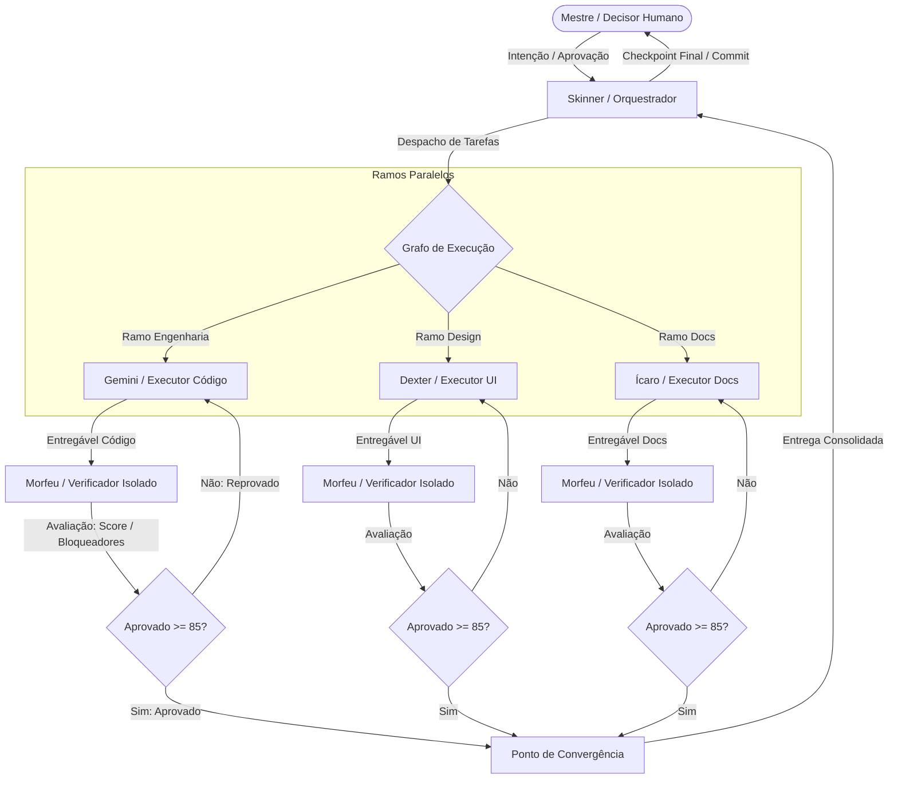

# Projeto Técnico e Decisões Arquiteturais (design.md)

**Fase 2 — Design Técnico**

Este documento traduz a especificação em solução técnica coerente com a plataforma estabelecida na ADR-0001.

## 1. Arquitetura do Sistema

O Fenix é uma aplicação **Web PWA offline-first**. Não possui backend.

### 1.1 Camadas
* **Core (Domínio/Cálculo):** TypeScript puro. Funções puras de entrada/saída. Sem dependências externas, sem DOM. Responsável pelo cálculo físico (Kienzle), derivativos (Taylor, deflexão) e checagem de alertas.
* **Storage (Persistência):** Camada de infraestrutura usando `IndexedDB`. Isola assincronia do core. Gerencia dados "de fábrica" (imutáveis) e customizados.
* **UI (Apresentação):** React + Vite. Estado reativo em memória.

### 1.2 Regra de dependência

`UI → Storage → Core`. O core não importa nada das outras duas camadas e não conhece `window`,
`document`, `fetch` nem `IndexedDB`. É isso que permite testá-lo em Node puro, e é a razão de a
suíte rodar com `environment: 'node'`.

## 2. Componentes e Estruturas

### 2.1 Módulos do Core (`/src/core`)

| Arquivo | Responsabilidade |
|---|---|
| `types.ts` | Contratos de dados. Nenhuma lógica |
| `materials.ts` | Repositório in-memory dos materiais de fábrica — transcrição dos canônicos, sem arbitragem |
| `calculator.ts` | Motor de equações: `calculateMilling`, `calculateDrilling`, `effectiveDiameter` |
| `analyzer.ts` | Gatilhos de alerta do `MVP §9.2` e a precedência de nível |
| `adjust.ts` | Edição de resultado (`MVP §8`): passo dos `±` e inversões `vf → fz` / `vf → fn` |
| `display.ts` | Formatação pt-BR e a lente de margem de segurança (`MVP §4.9`) |
| `index.ts` | Superfície pública do core |
| `tools.ts` | **Ainda não existe.** Repositório das 17 geometrias do `MAPEAMENTO_CAMPOS_FERRAMENTAS`. Nenhum AC do Ciclo 1 depende dele; entra junto da UI, que é quem consome geometria |

**Nomenclatura:** o core usa os símbolos dos canônicos (`n`, `vf`, `hm`, `Pc`, `Mc`), não os rótulos
de tela `S` e `F`. A tradução é da camada de exibição — `CANONICO_MOTOR_DE_CALCULO §1.7` mostra como
rótulo ambíguo de potência vira erro de fator `1/η`, e a mesma armadilha vale para rotação e avanço.

### 2.2 Estruturas de Dados

O contrato completo está em `src/core/types.ts`, que é a fonte. O esqueleto:

```typescript
interface Material {
  id: string;
  name: string;
  isoClass: 'P' | 'M' | 'K' | 'N' | 'S' | 'H';
  kc1_1: number;        // N/mm2 — CANONICO_MOTOR_DE_CALCULO §2.1
  mc: number;           // idem
  vcReference: number;  // m/min — MVP §11.2, vale para fresa de metal duro
  isCustom: boolean;
}

interface Alert {
  trigger: string;      // número do gatilho no MVP §9.2 — é o que dá rastreabilidade
  level: 'CRÍTICO' | 'ATENÇÃO';
  message: string;
}

interface MillingResult {
  n: number; vf: number; vcReal: number; De: number;   // o que vai para a máquina
  LD: number; eps: number; phiMax: number;             // geometria do engajamento
  hm: number; hex: number; ctf: number; kc: number;    // verificação — a lente não escala
  Q: number; Pc: number; Mc: number;                   // esforço
  safetyLevel: 'CRÍTICO' | 'ATENÇÃO' | 'NORMAL';
  alerts: Alert[];
}
```

**Por que o resultado é largo e não só `{S, F, Pc, Mc}`:** as grandezas de verificação (`hm`, `hex`,
`ctf`, `L/D`) são exibidas na tela em cartões próprios (`GABARITO_PROTOTIPO D7`) e a lente de margem
as trata diferente das demais (`MVP §4.9` regra 2). Devolvê-las obriga a UI a recalcular ou o core a
expor duas portas para a mesma cadeia — que é o defeito que o `MVP §8.1` chama de "segunda
implementação paralela".

## 3. Decisões Arquiteturais Vigentes

1. **Zero rede:** Sem chamadas CDN, fontes embarcadas, service worker offline.
2. **Separação UI / Cálculo:** O core é testado via NodeJS/Vitest puramente.
3. **O core devolve precisão plena.** Arredondamento é exibição (`MVP §4.9` regra 9: o cálculo nunca
   roda sobre valor escalado ou arredondado). **Exceção declarada:** o modo aço rápido trunca dentro
   da própria cadeia, porque o truncamento *é* a aritmética de oficina (`ESCOPO_BROCA_ACO_RAPIDO §2`).
4. **A lente de margem é pós-processamento**, não parâmetro do cálculo: `applySafetyMargin` recebe um
   resultado pronto e devolve outro. Passá-la como entrada faria o erro se compor a cada edição.
5. **A rotação editada entra como entrada**, via `nOverride`, e percorre a mesma cadeia do sentido
   direto (`MVP §8.1`, requisito absoluto).
6. **O analisador não vê o resultado inteiro** — recebe a entrada e as poucas grandezas derivadas de
   que precisa. Alerta que dependesse do número já escalado violaria a regra 5 do `MVP §4.9`.

## 4. Segurança / Restrições Técnicas

* Cálculo de ponto flutuante deve ser envelopado: `eps` satura em 1 (o arco não cresce além do rasgo
  cheio) e `kc` é avaliado em `max(h ; 0,001 mm)`.
* **Não lançar exceção em cálculo impossível;** retornar número e povoar `alerts` (US-003).
* **O que o core recusa** é entrada sem significado numérico — `D ≤ 0`, `Z ≤ 0`, rotação zero numa
  inversão. Não é condição física a avisar: é divisão por zero, e o resultado não descreveria nada.
  Lança `RangeError`.
* Nenhum número entra no core sem fonte citada no comentário (`CANONICO_MOTOR_DE_CALCULO`, regra
  "No Invention"). Vale para fórmula, constante do motor e limiar físico.

## 5. Questões Arquiteturais Pendentes (Open Questions)

* Não há perguntas em aberto bloqueantes.

## 6. Divergências conhecidas com o protótipo

O protótipo (`Docs_inicial/construcao/prototipo/index.html`) é o contrato do **painel** — layout,
fluxo, estados. Não é fonte de número: onde ele diverge dos canônicos, o canônico vence e o core
segue o canônico.

| Item | Protótipo | Core | Fonte que decide |
|---|---|---|---|
| Rotação e avanço no modo aço rápido | 509 rpm · 51 mm/min (arredonda `1000/π`) | **508 · 50** (trunca a partir de 318) | `ESCOPO_BROCA_ACO_RAPIDO §2`, caso verificador normativo |
| `kc1.1`, `mc` e `vc` de partida de 8 materiais | valores próprios do `js/mock-data.js` | só os pares publicados em `CANONICO_MOTOR_DE_CALCULO §2.1` e `MVP §11.2` | os canônicos. O mock é dado de demonstração, declarado como tal |
| Gatilho 4 (janela de `vc`) | não implementado | implementado, com a referência da combinação | `MVP §9.2` |
| Gatilho 10 (toroidal `ap < r`) | não implementado | implementado | `MVP §9.2`, nasce da lacuna L1 |
| Margem de segurança | escala `vf` antes de `Q` e `Pc`, então a cadeia roda sobre valor escalado | lente aplicada depois, sobre resultado pronto | `MVP §4.9` regra 9 |

---

## 7. Arquitetura Cognitiva e Frota de Agentes (Fase 3)

A Fase 3 estabelece a infraestrutura de orquestração autônoma do Fenix, transformando o desenvolvimento e a manutenção em um sistema multi-agente controlado, auditável e escalável baseado em três pilares: **ReAct**, **Harness Engineering** e **Graph Engineering**.

### 7.1 Os Três Pilares Cognitivos

1. **ReAct (Thought → Action → Observation):** Agentes interativos executam iterações estruturadas para inspecionar o ambiente, escolher ações através de ferramentas estritamente autorizadas, capturar os resultados reais (stdout, diffs, diagnósticos) e decidir os próximos passos com base em evidências empíricas, e não em suposições.
2. **Harness Engineering (Infraestrutura de Controle):** O modelo de linguagem atua como motor de inferência, enquanto o Harness (`harness_config.yml`) estabelece as fronteiras de contenção: controle estrito de ferramentas, escopo de arquivos acessíveis, limites de iteração/tempo, checkpoints e validação mecânica obrigatória antes de qualquer aceite.
3. **Graph Engineering (Grafo de Dependências e Convergência):** Tarefas são decompostas em um Grafo Direcionado Acíclico (DAG, formalizado em `grafo_fluxo.json`). Tarefas ortogonais executam em paralelo com contextos isolados. Cada ramo passa por verificação independente antes de convergir para o estado final consolidado.



---

### 7.2 Roster e Matriz de Responsabilidades

| Agente | Papel Cognitivo | Entradas | Saídas | Ferramentas Autorizadas | Permissões de Arquivos | Condições de Parada / Escalada |
|---|---|---|---|---|---|---|
| **Skinner** | Orquestrador | Intenção do Mestre, relatórios de verificação | Prompts de despacho, plano consolidado, commit git | `mcp_send_message`, `filesystem_read`, `git_cli` | Leitura total; escrita restrita a `Skinner/` e docs de estado | Para ao convergir o grafo; escala ao Mestre se houver 3 reprovações consecutivas |
| **Gemini** | Executor (Engenharia) | Especificação da tarefa, ACs do `spec.md`, arquivos fonte | Código TypeScript, testes Vitest, módulos do harness | `filesystem_read`, `filesystem_write`, `test_runner`, `typecheck` | Escrita em `src/`, `package.json`, `vitest.config.ts`, scripts | Para quando `check` passa; escala se houver conflito de contrato físico |
| **Dexter** | Executor (Design/UI) | Diretrizes visuais, gabaritos de tela, requisitos UX | Componentes React/CSS, layouts, folhas `.dc.html` | `filesystem_read`, `filesystem_write` | Escrita em `src/ui/`, CSS, templates HTML | Para quando o layout satisfaz os requisitos visuais |
| **Ícaro** | Executor (Documentação) | Relatórios de pesquisa, decisões de oficina, notas técnicas | Documentos canônicos, ADRs, `spec.md` | `filesystem_read`, `filesystem_write` | Escrita em `Docs_inicial/`, `docs/` | Para ao reconciliar o canônico; escala se houver ambiguidade de domínio |
| **Morfeu** | Verificador Independente | Apenas entregável + especificação + critérios de aceite | Relatório de auditoria estruturado (JSON/Markdown) | `filesystem_read`, `test_runner`, `typecheck`, `linter` | Somente leitura de código; escrita restrita a relatórios de auditoria | Para ao emitir o parecer; não altera código nem tenta consertar falhas |
| **Mestre** | Decisor Humano | Pontos de escalada, relatórios finais | Aprovações de produto, desbloqueio de impasses | - | Autoridade suprema sobre o repositório | Acionado em decisões irreversíveis ou quebras de invariantes |

---

### 7.3 O Loop ReAct e seus Limites Rígidos

Para agentes executores (especialmente Gemini em engenharia), a interação com o ambiente obedece ao loop:
1. **Thought (Raciocínio):** Avalia a lacuna atual entre o estado do código e o critério de aceite (AC).
2. **Action (Ação):** Invoca uma ferramenta permitida (ex: executar teste, modificar arquivo específico).
3. **Observation (Observação):** Analisa o retorno concreto da ferramenta (código de saída, erros do compilador, stack trace de teste).
4. **Next Decision (Próximo Passo):** Decide se o objetivo foi alcançado ou se é necessária uma nova iteração com base no erro observado.

**Travas contra Loops Improdutivos (Harness Guardrails):**
- **Teto de Iterações:** Máximo de 10 passos ReAct por ciclo de execução.
- **Detecção de Repetição:** Se a mesma ação for disparada 2 vezes com o mesmo erro de saída, o loop é interrompido para replanejamento.
- **Timeout Rígido:** 180 segundos por comando ou ferramenta externa.
- **Ausência de Progresso:** 3 iterações consecutivas sem alteração nos testes quebrando encerram a tentativa e registram falha para escalada.

---

### 7.4 Protocolo de Verificação Isolada e Threshold

A verificação segue o princípio: *«O criador não deve ser o único juiz do próprio resultado»*.

1. **Contexto Limpo:** O Verificador (Morfeu) **não** recebe o histórico de tentativas, dúvidas ou raciocínio interno do Executor. Ele recebe apenas:
   - O entregável gerado (diff/arquivos).
   - O contrato/especificação original da tarefa.
   - Os critérios objetivos de aceitação (ACs).
   - A evidência de execução mecânica dos testes.
2. **Estrutura da Avaliação do Verificador:**
   ```json
   {
     "status": "APROVADO" | "REPROVADO",
     "score": 0-100,
     "threshold_minimo": 85,
     "criterios_avaliados": [
       {"id": "AC-001", "atendido": true, "evidencia": "Teste milling.spec.ts passou"},
       {"id": "RULE-NO-DOM", "atendido": true, "evidencia": "Core livre de imports de UI/DOM"}
     ],
     "falhas": [
       {"descricao": "...", "severidade": "BAIXA" | "MEDIA" | "CRITICA", "correcao_sugerida": "..."}
     ]
   }
   ```
3. **Regra de Decisão do Gate:**
   - **Aprovado:** `score >= 85` E zero falhas de severidade `CRITICA`.
   - **Reprovado:** `score < 85` OU pelo menos uma falha `CRITICA`. O entregável retorna ao Executor com o feedback acionável.
   - **Teto de Retries:** Máximo de 3 ciclos de correção (Executor ↔ Verificador). Se persistir reprovado, a tarefa é pausada e escalada ao Skinner/Mestre.

---

### 7.5 Autonomia Controlada e Intervenção Humana

A autonomia dos agentes é ampla dentro de seu sandbox e menor privilégio, mas possui travas absolutas:
- **Autonomia Total Permitida:** Criar branches temporários, escrever testes, implementar código no domínio autorizado, executar suítes de teste locais, corrigir falhas apontadas pelo verificador.
- **Intervenção Humana Obrigatória (Mestre):**
  1. Alteração de fórmulas matemáticas nos documentos canônicos (`Docs_inicial/canonicos/`).
  2. Modificação ou exclusão de materiais e constantes físicas do motor Kienzle/Taylor.
  3. Commits ou merges diretamente na branch principal (`main`).
  4. Execução de comandos destrutivos no filesystem ou git (`git reset --hard`, `rm -rf`).
  5. Esgotamento do limite de retries da verificação isolada.

