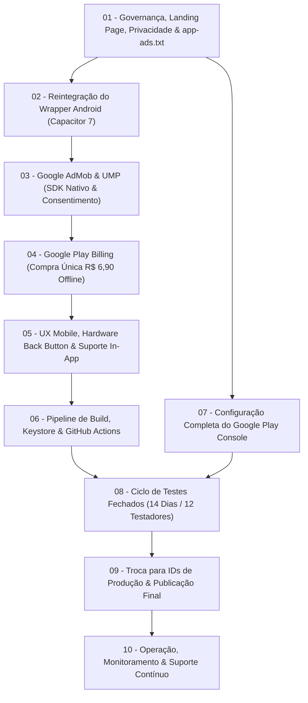

# 00_MASTER_PLAN.md — Plano Mestre de Lançamento Comercial do Produto

> **Produto:** ToolOptimizer CNC  
> **Versão Base:** 2.0.0 (SPA React 19 + TypeScript + Vite + IndexedDB)  
> **Estratégia de Distribuição:** Aplicativo Android na Google Play Store + Versão Web PWA  
> **Modelo de Monetização:** Híbrido — Gratuito com Google AdMob (Adaptive Banner no Topo) + Compra Única in-app de R$ 6,90 para remoção definitiva de anúncios via Google Play Billing (sem login/sem cadastro)  
> **Status Geral do Projeto:** Fase de Planejamento Executivo e Governança  
> **Documento de Revisão:** [PLAN_REVISION.md](PLAN_REVISION.md)  

---

## 1. Objetivo do Projeto

Transformar o sistema da calculadora industrial **ToolOptimizer CNC** — atualmente em produção e funcional na web — em um **produto comercial completo, sustentável e operacionalmente autônomo**, composto por:
1. Um **aplicativo Android nativo** (empacotado via Capacitor 7), rápido, seguro e de alto desempenho;
2. Conformidade absoluta com todas as diretrizes técnicas e regulatórias da **Google Play Store** e da **LGPD**;
3. Preservação estrita da arquitetura **100% Offline-First** e da integridade física de cálculo do **Modelo de Kienzle** (120 testes automatizados);
4. Monetização profissional de baixo atrito: Grátis com anúncios discretos do **Google AdMob** ou **R$ 6,90 vitalício** para remover anúncios via **Google Play Billing**;
5. **Zero Login e Zero Backend:** Operação 100% serverless, sem custos fixos de banco de dados ou servidores, gerenciada integralmente pelos consoles oficiais do Google e Cloudflare.

---

## 2. Estado Atual do Sistema (Auditoria Base)

| Componente | Situação | Detalhes Técnicos |
|---|:---:|---|
| **Motor Físico de Kienzle** | `100% ESTÁVEL` | Implementação canônica para Fresamento, Furação, Roscamento e Mandrilamento. Validação geométrica e dinâmica com tolerância de $\pm 5\%$. |
| **Suíte de Testes** | `120/120 APROVADOS` | Execução completa com `npm run check` (TypeScript, Vitest e ESLint 100% verdes). |
| **Armazenamento de Dados** | `OFFLINE LOCAL` | IndexedDB (`tooloptimizer_db`). Ferramentas, materiais e máquinas gravados exclusivamente no dispositivo do usuário. |
| **Interface & UX** | `DUPLA CASCA` | Layout responsivo desktop e casca mobile dedicada (`MobileCalculator.tsx`, `MobileStickyBar.tsx`, `MobileResultsSheet.tsx`). |
| **Presença Web** | `ONLINE` | Landing page publicada no Cloudflare Pages em `www.tooloptimizercnc.com.br`. |
| **Conta Google Play** | `ATIVA E PAGA` | Conta de Desenvolvedor Pessoa Física (PF) aprovada pelo Google (taxa de US$ 25 quitada). |
| **E-mail Oficial** | `DEFINIDO` | `tooloptimizercnc@gmail.com` estabelecido como canal oficial único de governança, loja e suporte. |

---

## 3. Decisões Estratégicas Consolidadas

* **D-01 (Sem Login / Sem Cadastro):** O operador de chão de fábrica não precisa criar usuário ou senha. O produto funciona imediatamente após o download.
* **D-02 (Zero Backend Próprio / Serverless):** Toda a inteligência computacional é executada no dispositivo (client-side). Não há custos mensais com servidores ou risco de vazamento de bancos de dados em nuvem.
* **D-03 (Consoles Oficiais como Painel Administrativo):** Não será desenvolvido painel administrativo web com backend. A gestão financeira é feita no *Google Play Console*, a monetização no *Google AdMob Console*, e as métricas web no *Cloudflare Pages Analytics*. A edição de materiais/ferramentas é feita localmente no app em `SettingsView.tsx`.
* **D-04 (Preço da Compra In-App):** Valor fixo definitivo de **R$ 6,90** para o SKU `br.com.tooloptimizercnc.remove_ads`, sem menções a "preço promocional de lançamento".
* **D-05 (AdMob Exclusivamente Nativo):** O AdMob será instanciado exclusivamente via SDK Nativo Google Mobile Ads (GMA) no wrapper Android, sendo expressamente proibido o uso de AdSense web no WebView.
* **D-06 (Conformidade com Testes Fechados):** Cumprimento integral da política obrigatória do Google Play para contas de Pessoa Física: 14 dias ininterruptos de teste fechado com no mínimo 12 testadores recrutados.

---

## 4. Classificação das Demandas Operacionais do Lançamento

Cada necessidade do produto está categorizada formalmente:

* 🔴 **BLOQUEADOR:** Impede o avanço do desenvolvimento ou a submissão à loja se não for concluído.
* 🟡 **OBRIGATÓRIO PARA LANÇAMENTO:** Requisito formal do Google ou da legislação para publicação comercial.
* 🟢 **NECESSÁRIO PARA OPERAÇÃO:** Essencial para a sustentabilidade, suporte ao operador e governança contínua.
* 🔵 **RECOMENDADO:** Melhora a conversão orgânica ou usabilidade, mas não impede a publicação.
* ⚪ **NÃO NECESSÁRIO:** Demandas investigadas e descartadas formalmente por decisão de arquitetura.

| Item | Classificação | Área | Justificativa / Solução |
|---|:---:|:---:|---|
| **Política de Privacidade em URL Pública** | 🔴 `BLOQUEADOR` | Jurídico / Web | Exigência da Google Play para aprovação da ficha. URL: `www.tooloptimizercnc.com.br/politica-de-privacidade`. |
| **Arquivo `app-ads.txt` na Raiz Web** | 🔴 `BLOQUEADOR` | Publicidade / Web | Evita bloqueio e perda de 90%+ da receita de anúncios no AdMob. |
| **Target SDK 35 & Gradle 8+** | 🔴 `BLOQUEADOR` | Plataforma Android | Exigência técnica do Google Play para novos apps em 2026. |
| **Closed Testing (14 dias / 12 testadores)** | 🔴 `BLOQUEADOR` | Google Play Console | Regra temporal rígida do Google para contas PF criadas após nov/2023. |
| **Disclaimer de Usinagem CNC** | 🟡 `OBRIGATÓRIO` | Jurídico / UX | Proteção legal contra responsabilidade civil por parâmetros sugeridos. |
| **SDK Google AdMob Nativo + UMP** | 🟡 `OBRIGATÓRIO` | Publicidade / Android | Conformidade com LGPD/GDPR e políticas de publicidade do Google. |
| **Play Billing Library (R$ 6,90) Offline** | 🟡 `OBRIGATÓRIO` | Monetização | Produto `remove_ads` com suporte a validação e persistência offline. |
| **Hardware Back Button Tratado** | 🟡 `OBRIGATÓRIO` | UX Mobile | Fecha modais (`MobileResultsSheet`) sem fechar o app abruptamente. |
| **Pipeline de Build Release & Keystore** | 🟡 `OBRIGATÓRIO` | DevOps / Segurança | Geração segura e reproduzível do `.aab` assinado via GitHub Actions. |
| **Canal de Suporte e Feedback no App** | 🟢 `NECESSÁRIO` | Suporte | Botão em `SettingsView.tsx` abrindo `mailto:tooloptimizercnc@gmail.com`. |
| **Android Vitals & Monitoramento** | 🟢 `NECESSÁRIO` | Monitoramento | Garantir crash rate < 1.09% e ANR < 0.47% no console da Play Store. |
| **Proteção de Migração do IndexedDB** | 🟢 `NECESSÁRIO` | Engenharia | Garantir que updates do app nunca apaguem ferramentas salvas pelo usuário. |
| **Otimização de Ficha (ASO em Português)** | 🔵 `RECOMENDADO` | Aquisição | Palavras-chave de usinagem (Kienzle, avanço, RPM, fresamento, CNC). |
| **Painel Web Administrativo Próprio** | ⚪ `NÃO NECESSÁRIO` | Arquitetura | Substituído integralmente pelos consoles oficiais do Google e Cloudflare. |
| **Sistema de Autenticação / Login de Usuário**| ⚪ `NÃO NECESSÁRIO` | Arquitetura | O app é 100% offline-first; cadastros gerariam fricção e riscos de LGPD. |

---

## 5. O Roadmap Oficial em 10 Etapas

| Etapa | Nome da Etapa | Diretório | Situação | Prioridade |
|:---:|---|:---:|:---:|:---:|
| **01** | Governança, Landing Page, Privacidade & `app-ads.txt` | [01-etapa/](01-etapa/README.md) | **PENDENTE** | 🔴 `BLOQUEADOR` |
| **02** | Reintegração do Wrapper Android (Capacitor 7) | [02-etapa/](02-etapa/README.md) | **PENDENTE** | 🔴 `BLOQUEADOR` |
| **03** | Google AdMob & UMP (SDK Nativo & Consentimento) | [03-etapa/](03-etapa/README.md) | **PENDENTE** | 🟡 `OBRIGATÓRIO` |
| **04** | Google Play Billing (Compra Única R$ 6,90 Offline) | [04-etapa/](04-etapa/README.md) | **PENDENTE** | 🟡 `OBRIGATÓRIO` |
| **05** | UX Mobile, Hardware Back Button & Suporte In-App | [05-etapa/](05-etapa/README.md) | **PENDENTE** | 🟡 `OBRIGATÓRIO` |
| **06** | Pipeline de Build Release, Keystore & GitHub Actions | [06-etapa/](06-etapa/README.md) | **PENDENTE** | 🟡 `OBRIGATÓRIO` |
| **07** | Configuração Completa de Consoles (Play & AdMob) | [07-etapa/](07-etapa/README.md) | **PENDENTE** | 🔴 `BLOQUEADOR` |
| **08** | Ciclo de Testes Fechados (14 Dias / 12 Testadores) | [08-etapa/](08-etapa/README.md) | **PENDENTE** | 🔴 `BLOQUEADOR TEMPORAL` |
| **09** | Troca para IDs de Produção & Publicação Final | [09-etapa/](09-etapa/README.md) | **PENDENTE** | 🔴 `MÁXIMA` |
| **10** | Operação, Monitoramento & Suporte Contínuo | [10-etapa/](10-etapa/README.md) | **PENDENTE** | 🟢 `CONTÍNUA` |

---

## 6. Resumo Executivo das Etapas

### [Etapa 01: Governança, Landing Page, Privacidade & app-ads.txt](01-etapa/README.md)
* **Escopo:** Criação da página estática de Política de Privacidade em `landing/politica-de-privacidade.html`, criação do arquivo `app-ads.txt` na raiz do domínio, alinhamento dos textos que mencionam "sem anúncios", inclusão de links institucionais e do Disclaimer Jurídico de Isenção de Responsabilidade de Usinagem CNC.
* **Entregáveis:** URLs ativas em `https://www.tooloptimizercnc.com.br/politica-de-privacidade` e `/app-ads.txt`, canal `tooloptimizercnc@gmail.com` visível.

### [Etapa 02: Reintegração do Wrapper Android (Capacitor 7)](02-etapa/README.md)
* **Escopo:** Instalação do Capacitor 7 moderno, configuração de `capacitor.config.ts` com o applicationId `br.com.tooloptimizercnc.app`, geração do projeto `android/` com Gradle 8+, Target SDK 35 e sincronização automatizada dos assets compilados de `dist/`.
* **Entregáveis:** Configuração nativa funcional, ícones adaptativos industriais e splash screen configurada.

### [Etapa 03: Google AdMob & UMP (SDK Nativo & Consentimento)](03-etapa/README.md)
* **Escopo:** Integração do plugin nativo `@capacitor-community/admob`, implementação do User Messaging Platform (UMP) para GDPR/LGPD, criação de serviço de anúncios com banner adaptativo no topo do app, garantindo falha silenciosa no modo offline.
* **Entregáveis:** Módulo `admobService.ts`, meta-tags de App ID no `AndroidManifest.xml`, teste com IDs de teste oficiais do Google.

### [Etapa 04: Google Play Billing (Compra Única R$ 6,90 Offline)](04-etapa/README.md)
* **Escopo:** Integração nativa com a Google Play Billing Library para compra do SKU `remove_ads` por R$ 6,90. Implementação de restauração automática transparente pela conta Google do aparelho e gravação de cache local persistente para funcionamento offline.
* **Entregáveis:** Módulo `billingService.ts`, botão de compra e restauração em `SettingsView.tsx`, teste de fluxo de compra com conta de teste sandbox do Google Play.

### [Etapa 05: UX Mobile, Hardware Back Button & Suporte In-App](05-etapa/README.md)
* **Escopo:** Interceptação do botão físico "Voltar" do Android via `@capacitor/app` para fechar gavetas e modais (`MobileResultsSheet`, `SettingsView`) antes de encerrar o aplicativo; configuração de safe areas de topo e base; inclusão de botão "Fale Conosco / Suporte" com link `mailto:tooloptimizercnc@gmail.com`.
* **Entregáveis:** Experiência nativa polida, sem fechamentos acidentais e com canal de suporte acessível.

### [Etapa 06: Pipeline de Build Release, Keystore & GitHub Actions](06-etapa/README.md)
* **Escopo:** Geração segura do par de chaves de release (`.keystore`/`.jks`), armazenamento criptografado dos segredos no repositório GitHub e criação do workflow de CI/CD para compilação reproduzível do Android App Bundle (`.aab`) assinado.
* **Entregáveis:** Keystore gerada e guardada com segurança, pipeline `.github/workflows/build-android.yml` operacional gerando `.aab`.

### [Etapa 07: Configuração Completa de Consoles (Play & AdMob)](07-etapa/README.md)
* **Escopo:** Cadastro da ficha completa do app no Google Play Console (título, descrições ASO, ícone 512x512, feature graphic 1024x500, screenshots reais); preenchimento do questionário IARC, formulário de Data Safety e ativação do Perfil de Pagamentos (Merchant Account); criação das Ad Units no AdMob Console vinculadas ao `app-ads.txt`.
* **Entregáveis:** Ficha Play Store 100% pronta, produto `remove_ads` (R$ 6,90) ativo no console, Ad Units criadas e validadas.

### [Etapa 08: Ciclo de Testes Fechados (14 Dias / 12 Testadores)](08-etapa/README.md)
* **Escopo:** Envio da primeira versão release para a faixa de Teste Fechado (Closed Testing), ativação da lista de 12+ testadores voluntários, acompanhamento do engajamento diário durante o período regulamentar de 14 dias e monitoramento de falhas via Android Vitals.
* **Entregáveis:** Cumprimento comprovado dos 14 dias com 12+ testadores ativos, zero falhas críticas registradas e liberação do acesso à faixa de Produção no Play Console.

### [Etapa 09: Troca para IDs de Produção & Publicação Final](09-etapa/README.md)
* **Escopo:** Substituição segura dos IDs de teste do AdMob pelos IDs de produção oficiais, compilação do `.aab` final de produção assinado, submissão da versão para a faixa de Produção e acompanhamento do processo de revisão da equipe do Google.
* **Entregáveis:** Aplicativo aprovado e publicado publicamente na Google Play Store para download gratuito.

### [Etapa 10: Operação, Monitoramento & Suporte Contínuo](10-etapa/README.md)
* **Escopo:** Acompanhamento contínuo dos limiares de qualidade no Android Vitals (Crash rate < 1.09%, ANRs < 0.47%), monitoramento de receita e fill-rate no AdMob Console, gestão de vendas e reembolsos no Play Console, atendimento a dúvidas de suporte via `tooloptimizercnc@gmail.com` e rotina de updates com garantia de não-regressão do IndexedDB.
* **Entregáveis:** Produto operando de forma estável, rentável e segura no mercado.

---

## 7. Critérios Globais de Aceite do Lançamento

O lançamento será considerado bem-sucedido quando:
1. **Disponibilidade Pública:** O app estiver pesquisável e instalável globalmente pela Google Play Store;
2. **Engenharia Intacta:** Os 120 testes automatizados continuarem passando com 100% de sucesso;
3. **Resiliência Offline:** O operador conseguir calcular parâmetros CNC complexos mesmo sem conexão de rede (Modo Avião);
4. **Monetização Ativa e Segura:** O AdMob veicular banners sem cliques acidentais e o Play Billing permitir a compra e restauração definitiva da remoção de anúncios por R$ 6,90;
5. **Estabilidade Comprovada:** O índice de falhas no Android Vitals for nulo ou rigorosamente abaixo dos limites do Google;
6. **Zero Custo de Servidor:** Toda a operação rodar sem nenhuma fatura de backend ou banco de dados na nuvem.
