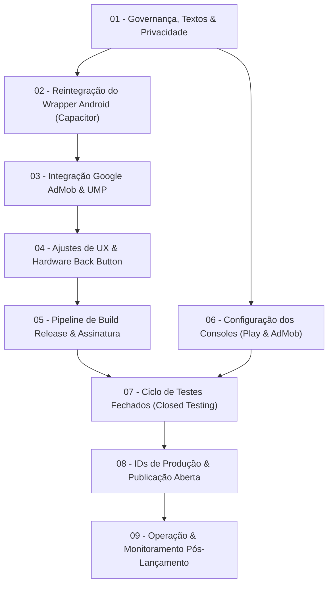

# 00_MASTER_PLAN.md — Plano Mestre de Lançamento na Google Play Store

> **Produto:** ToolOptimizer CNC  
> **Versão Base:** 2.0.0 (SPA React 19 + TypeScript + Vite + IndexedDB)  
> **Estratégia de Distribuição:** Aplicativo Android na Google Play Store + Versão Web PWA  
> **Modelo de Monetização Inicial:** Híbrido — Gratuito com Google AdMob (Banner no Topo) + Compra Única in-app de R$ 6,90 para remoção definitiva de anúncios via Google Play Billing (sem login/sem cadastro)  

---

## 1. Objetivo do Projeto

Transformar o sistema atual da calculadora industrial **ToolOptimizer CNC** — que já se encontra em produção e funcional na web — em um aplicativo Android seguro, estável, devidamente testado e em estrita conformidade com as diretrizes da **Google Play Store**, monetizado de maneira profissional e não intrusiva via **Google AdMob (com opção de compra única de R$ 6,90 para remoção de anúncios)**, preservando o funcionamento 100% offline-first no chão de fábrica e a integridade de cálculo do modelo de Kienzle.

---

## 2. Estado Atual do Sistema

- **Arquitetura:** SPA React 19 + TypeScript + Vite 8, sem dependência de APIs ou backend externo para processamento de cálculos.
- **Motor Físico:** Implementação canônica do modelo de Kienzle para as 4 famílias de usinagem (Fresamento, Furação, Roscamento e Mandrilamento), com validação geométrica, dinâmica de $\pm 5\%$ e semáforo de segurança.
- **Persistência:** 100% Offline-First via IndexedDB (`tooloptimizer_db`). Configurações de máquina, materiais do usuário e ferramentas salvas estritamente no cliente.
- **Interface:** Layout responsivo para desktop e casca mobile dedicada (`MobileCalculator.tsx`, `MobileStickyBar.tsx`, `MobileResultsSheet.tsx`).
- **Testes & Quality Gate:** 120 testes automatizados no Vitest passando com 100% de sucesso (`npm run check` verde).
- **Contas & Plataformas:** Conta de Desenvolvedor no **Google Play Console (Pessoa Física)** já existente, **ativa, paga e aprovada**; Google AdMob e política de privacidade em URL pública em fase de configuração.

---

## 3. Objetivo Final de Lançamento

1. Disponibilizar o aplicativo gratuitamente na Google Play Store em formato Android App Bundle (`.aab`) assinado;
2. Integrar publicidade do Google via Google AdMob com consentimento UMP (GDPR/LGPD), posicionada de forma a não causar cliques acidentais nem interferir na operação da máquina CNC;
3. Manter a política de **zero autenticação/sem cadastro**, eliminando atrito para o operador e dispensando fluxos de exclusão de conta na Play Store;
4. Cumprir todos os requisitos técnicos da Google Play (Target SDK 35/36, Android Vitals, política de privacidade pública, formulário de Data Safety e conformidade com IARC);
5. Estabelecer esteira de compilação reproduzível (via GitHub Actions) para geração e publicação contínua dos artefatos de release.

---

## 4. As 9 Etapas de Execução

| Etapa | Nome da Etapa | Situação Atual | Dependências | Prioridade |
|:---:|---|:---:|:---:|:---:|
| **01** | [Governança, Textos e Política de Privacidade](01-etapa/README.md) | **PENDENTE** | Nenhuma | **BLOQUEADOR** |
| **02** | [Reintegração do Wrapper Android (Capacitor)](02-etapa/README.md) | **PENDENTE** | Etapa 01 | **BLOQUEADOR** |
| **03** | [Integração do Google AdMob e Consentimento UMP](03-etapa/README.md) | **PENDENTE** | Etapa 02 | **ALTA** |
| **04** | [Ajustes de UX Industrial e Hardware Back Button](04-etapa/README.md) | **PENDENTE** | Etapa 02 | **MÉDIA-ALTA** |
| **05** | [Pipeline de Build Release e Assinatura Digital](05-etapa/README.md) | **PENDENTE** | Etapas 02, 03, 04 | **ALTA** |
| **06** | [Configuração de Consoles (Google Play & AdMob)](06-etapa/README.md) | **PENDENTE** | Etapas 01, 05 | **BLOQUEADOR** |
| **07** | [Ciclo de Testes Fechados (Closed Testing)](07-etapa/README.md) | **PENDENTE** | Etapas 05, 06 | **BLOQUEADOR TEMPORAL** |
| **08** | [Troca para IDs de Produção e Lançamento](08-etapa/README.md) | **PENDENTE** | Etapa 07 | **MÁXIMA** |
| **09** | [Operação e Monitoramento Pós-Lançamento](09-etapa/README.md) | **PENDENTE** | Etapa 08 | **CONTÍNUA** |

---

## 5. Resumo das Etapas e Principais Entregáveis

### [Etapa 01: Governança, Textos e Política de Privacidade](01-etapa/README.md)
- **Escopo:** Criação da página estática de Política de Privacidade, ajuste dos textos de marketing que prometem "sem anúncios", inclusão de links de privacidade no rodapé e no app, e criação do arquivo `app-ads.txt`.
- **Entregáveis:** Página `politica-de-privacidade.html` no Cloudflare, arquivo `public/app-ads.txt` publicado na raiz do domínio, textos institucionais alinhados.

### [Etapa 02: Reintegração do Wrapper Android (Capacitor)](02-etapa/README.md)
- **Escopo:** Instalação do Capacitor 6/7 moderno, configuração de `capacitor.config.ts`, geração do projeto `android/` com Gradle moderno, Target SDK 35/36 e sincronização dos assets compilados de `dist/`.
- **Entregáveis:** Configuração `capacitor.config.ts`, diretório `android/` funcional e compilável, ícones e splash screens nativos configurados.

### [Etapa 03: Integração do Google AdMob e Consentimento UMP](03-etapa/README.md)
- **Escopo:** Adição do plugin nativo de AdMob, implementação de camada de consentimento UMP para GDPR/LGPD, criação de serviço de anúncios desacoplado que opera somente no Android, posicionamento de Banner não intrusivo no topo, e integração do plugin nativo de In-App Purchase (Google Play Billing) para o produto de remoção definitiva de anúncios (`br.com.tooloptimizercnc.remove_ads` por R$ 6,90).
- **Entregáveis:** Módulo `admobService.ts`, meta-tags AdMob no `AndroidManifest.xml`, integração de Google Play Billing sem login com verificação em cache offline, banners de teste operacionais e fluxo de compra funcional.

### [Etapa 04: Ajustes de UX Industrial e Hardware Back Button](04-etapa/README.md)
- **Escopo:** Interceptação do botão físico "Voltar" do Android para fechar modais (`MobileResultsSheet` e `SettingsView`) antes de sair do app, configuração de safe areas e status bar com as cores do Design System.
- **Entregáveis:** Listener de `backButton` em `@capacitor/app`, ajuste de viewport com safe-area-inset, teste de usabilidade mobile.

### [Etapa 05: Pipeline de Build Release e Assinatura Digital](05-etapa/README.md)
- **Escopo:** Geração de par de chaves de release (`.keystore`/`.jks`), criação de workflow automatizado no GitHub Actions para compilação do Android App Bundle (`.aab`) com JDK 17 e Gradle 8+.
- **Entregáveis:** Arquivo `.jks` armazenado com segurança, workflow `.github/workflows/build-android.yml`, artefato `app-release.aab` assinado e reproduzível.

### [Etapa 06: Configuração de Consoles (Google Play & AdMob)](06-etapa/README.md)
- **Escopo:** Cadastro da ficha do app na Google Play Store (título, descrição, screenshots, ícone 512x512, feature graphic 1024x500), ativação da Conta de Comerciante (Merchant Account), cadastro do produto in-app `remove_ads` (R$ 6,90), preenchimento do questionário IARC, formulário de Data Safety e configuração das Ad Units no AdMob.
- **Entregáveis:** Ficha Play Store 100% preenchida, produto in-app ativo no console, questionários aprovados, Ad Units criadas e vinculadas ao `app-ads.txt`.

### [Etapa 07: Ciclo de Testes Fechados (Closed Testing)](07-etapa/README.md)
- **Escopo:** Envio da versão release para a faixa de teste fechado, recrutamento de testadores (mínimo 12 para cumprir a regra obrigatória de 14 dias contínuos em contas individuais), e monitoramento de estabilidade via Android Vitals.
- **Entregáveis:** 12+ testadores ativos por 14 dias, telemetria de zero falhas críticas, liberação do acesso à produção no Play Console.

### [Etapa 08: Troca para IDs de Produção e Lançamento](08-etapa/README.md)
- **Escopo:** Substituição segura dos Ad Units de teste por IDs de produção reais, geração do `.aab` final, submissão da versão para a faixa de Produção e acompanhamento da revisão do Google.
- **Entregáveis:** `.aab` final com credenciais de produção submetido e aprovado pelo Google Play, aplicativo online publicamente.

### [Etapa 09: Operação e Monitoramento Pós-Lançamento](09-etapa/README.md)
- **Escopo:** Acompanhamento contínuo de métricas vitais (Crash rate < 1.09%, ANRs < 0.47%), monitoramento de fill rate e receita de anúncios no AdMob, suporte e ciclo de atualizações.
- **Entregáveis:** Painel de saúde operacional estável, rotina de manutenção de versões sem quebra de IndexedDB local.

---

## 6. Critérios Gerais de Conclusão do Lançamento

O projeto de lançamento será considerado concluído com êxito quando os seguintes critérios forem satisfeitos:

1. **Disponibilidade Pública:** O aplicativo estiver publicado e pesquisável na Google Play Store para download gratuito;
2. **Integridade de Engenharia:** Os 120 testes de cálculo físico continuarem passando com 100% de sucesso sem regressão;
3. **Operação Offline Preservada:** O aplicativo calcular perfeitamente mesmo quando o smartphone estiver em Modo Avião ou sem rede;
4. **Monetização Ativa e Segura:** Os anúncios do AdMob forem carregados em conformidade com o consentimento UMP, sem gerar cliques acidentais nem violar políticas do Google;
5. **Estabilidade Comprovada:** O Android Vitals registrar taxa de falhas (crashes e ANRs) rigorosamente abaixo dos limiares de penalização do Google Play.
