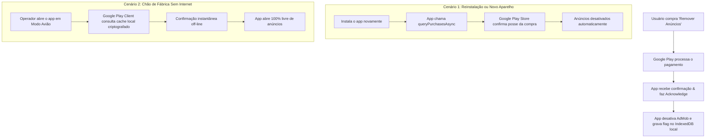
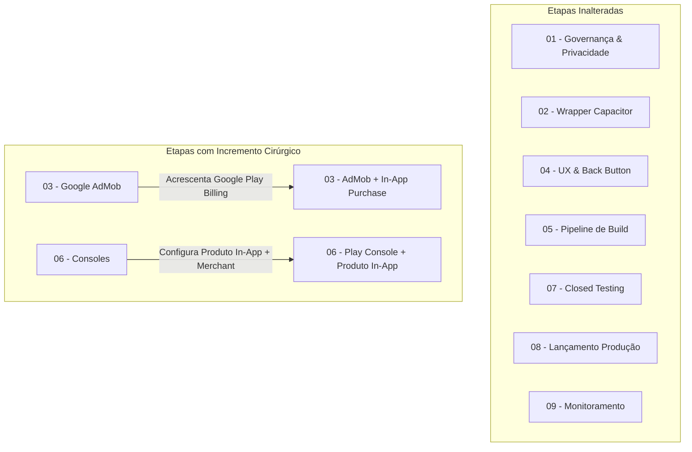

# MONETIZATION_RESEARCH.md — Investigação Estratégica de Monetização: ToolOptimizer CNC

> **Projeto:** ToolOptimizer CNC (v2.0.0)  
> **Data de Investigação:** Setembro de 2026  
> **Objetivo:** Determinar a estratégia de monetização mais eficiente, estável e segura para o lançamento do aplicativo na Google Play Store, analisando a viabilidade técnica, impacto na experiência do operador industrial, conformidade com políticas do Google e compatibilidade com a arquitetura offline-first e sem login.  
> **Classificação dos Dados:** Fato confirmado | Dado de mercado | Interpretação | Hipótese | Recomendação.  

---

## 1. Resumo Executivo

- **Contexto:** O ToolOptimizer CNC é uma ferramenta técnica de precisão física (modelo de Kienzle nas 4 famílias de usinagem) voltada para programadores CAM, operadores de máquinas CNC e ferramenteiros. A aplicação foi concebida como **offline-first**, determinística e opera com **zero atrito de cadastro (sem login/conta própria)**.
- **Pergunta Central:** Qual estratégia de monetização entrega o melhor equilíbrio entre receita, experiência de usuário em chão de fábrica, viabilidade técnica sob runtime Capacitor e conformidade com o Google Play?
- **Principais Conclusões da Pesquisa:**
  1. **Google AdMob vs. AdSense:** O uso de Google AdSense padrão dentro de WebViews no Android é **terminantemente proibido** pelas políticas do Google e acarreta encerramento sumário de conta. Para o aplicativo Android, o produto obrigatório é o **Google Mobile Ads (GMA) SDK integrado com Google AdMob**.
  2. **Viabilidade Técnica da Remoção Paga Sem Login:** É **100% tecnicamente viável** oferecer a compra in-app de remoção de anúncios sem criar sistema de login proprietário. O **Google Play Billing** vincula a compra à Conta Google do usuário no dispositivo Android. O aplicativo consulta a posse do item via `queryPurchasesAsync()`, com suporte nativo a cache offline, restauração automática pós-reinstalação e compartilhamento entre múltiplos dispositivos do mesmo usuário.
  3. **Realidade de Receita de Banners no Brasil:** O eCPM médio de banners para utilitários Android no Brasil varia entre **US$ 0,10 e US$ 0,60** por 1.000 impressões. Em um nicho técnico com volume inicial estimado de 1.000 a 3.000 usuários ativos, a receita exclusiva de banners seria de apenas **R$ 25 a R$ 100/mês**, exigindo centenas de milhares de impressões para atingir o piso de saque do AdMob (R$ 500 / US$ 100).
  4. **Poder Alavancador da Compra Única:** Uma única compra in-app de baixo valor (ex: **R$ 14,90 a R$ 19,90**) equivale à receita de **15.000 a 30.000 impressões de banner** de um mesmo usuário. Se apenas 3% a 5% da base de operadores adquirir o desbloqueio para eliminar anúncios no chão de fábrica, a receita inicial é multiplicada por 10x a 20x.
  5. **Ambiente Industrial de Uso:** O operador frequentemente manuseia o celular com luvas, sob iluminação variável e com a máquina CNC ligada. Intersticiais de tela cheia ou banners colados na barra de comandos inferior (`MobileStickyBar`) geram **risco crítico de cliques acidentais**, violação das diretrizes do Google e rejeição imediata do produto.
- **Recomendação Estratégica:** Adotar o modelo híbrido **Estratégia B (Gratuito com Banner Adaptativo Não Intrusivo no Topo + Compra Única via Google Play Billing para Remover Anúncios Permanentemente)**, lançado com faseamento controlado.

---

## 2. Contexto do Produto e Restrições Operacionais

| Parâmetro do Produto | Estado Real / Restrição | Impacto na Monetização |
|---|---|---|
| **Público-Alvo** | Operadores CNC, programadores CAM, preparadores de ferramentas e ferramenteiros. | Público técnico, pragmático e com baixa tolerância a distrações visuais ou interrupções de fluxo de trabalho. |
| **Ambiente de Uso** | Chão de fábrica, galpões industriais, oficinas mecânicas (ambiente ruidoso, operador com luvas, mãos sujas). | Risco extremo de toques involuntários. Banners não podem disputar espaço com a zona de polegar (*thumb zone*). |
| **Conectividade** | Frequente ausência de sinal celular ou Wi-Fi blindado por estruturas metálicas industriais. | O app é **100% offline-first**. A monetização não pode bloquear cálculos físicos quando o dispositivo estiver sem internet. |
| **Arquitetura de Dados** | Persistência local estrita em IndexedDB (`tooloptimizer_db`). Sem banco em nuvem. | Inexistência de backend próprio para validar sessões ou armazenar credenciais de usuários. |
| **Autenticação** | **Zero login / Sem cadastro** (decisão de arquitetura homologada). | A validação de compras ou preferências deve apoiar-se exclusivamente em mecanismos locais e na Conta Google do aparelho. |
| **Runtime Android** | Empacotamento híbrido com **Capacitor 6/7** sobre assets estáticos Vite (`dist/`). | Exige plugins nativos oficiais para comunicação com o Google Mobile Ads SDK e com a Google Play Billing Library. |

---

## 3. AdMob vs. AdSense: Análise Regulatória e Técnica

Uma das dúvidas mais comuns em aplicações web empacotadas para celular é se seria possível reutilizar o código do Google AdSense web dentro do aplicativo.

> [!CAUTION]
> **Fato Confirmado (Políticas do Google AdSense e Google Play):**
> É expressamente proibido inserir código padrão do Google AdSense (JavaScript web) dentro de WebViews de aplicativos móveis distribuídos em lojas como a Google Play Store.

### Tabela Comparativa Regulatória

| Característica | Google AdSense | Google AdMob |
|---|---|---|
| **Destinação Oficial** | Sites web abertos para navegadores desktop e mobile. | Aplicativos móveis nativos e híbridos (Android e iOS). |
| **SDK Utilizado** | Tags HTML/JavaScript (`adsbygoogle.js`). | **Google Mobile Ads (GMA) SDK** nativo via plugin Capacitor. |
| **Conformidade em WebViews** | **VIOLAÇÃO DE POLÍTICA.** O Google proíbe AdSense em WebViews sem a implementação da complexa *WebView API for Ads* conectada ao GMA SDK. O descumprimento gera suspensão da conta AdSense e do domínio. | **100% CONFORME.** É a solução oficial e recomendada pelo Google para monetização de apps Android. |
| **Acesso a Sinais do Dispositivo** | Limitado aos dados do navegador. Não acessa identificador de publicidade (GAID) nem telemetria de app. | Completo: integra Advertising ID, métricas de sessão, retenção e conformidade com o Google Play Console. |
| **Formatos Suportados** | Banners display de página web, blocos in-article, auto-ads. | **Banners Adaptativos**, Intersticiais, Anúncios Premiados (Rewarded) e Nativos Avançados. |
| **Consentimento Legal (UMP)** | Gerenciado via Consent Management Platform (CMP) web. | Gerenciado via **User Messaging Platform (UMP) SDK** nativo integrado ao Android. |
| **Arquivo de Autorização** | `ads.txt` na raiz do domínio web. | `app-ads.txt` na raiz do domínio vinculado à ficha da Google Play Store. |

**Conclusão Técnica:** O **Google AdMob** é a **única** solução viável e regulatoriamente aprovada pelo Google para o aplicativo Android do ToolOptimizer CNC. O AdSense fica restrito à eventual monetização do portal/landing page na web aberta, se desejado no futuro.

---

## 4. Estratégias de Monetização Avaliadas

### Estratégia A — Gratuito Apoiado Exclusivamente por Anúncios (AdMob)
- **Mecanismo:** O aplicativo é 100% gratuito para todos os usuários. A monetização é gerada exclusivamente pela exibição de anúncios publicitários servidos pelo Google AdMob.
- **Formato Recomendado:** **Banner Adaptativo Ancorado no Topo** da tela (`Anchored Adaptive Banner`).
- **Comportamento Operacional:**
  - O banner ajusta dinamicamente sua largura à largura física da tela do aparelho, mantendo uma altura pequena e proporcional (entre 50dp e 90dp);
  - Fica posicionado logo abaixo do `MobileHeader` e acima da navegação de famílias de usinagem;
  - Não sobrepõe nenhum campo numérico de entrada (`StepperInput`), nem compete com a barra de resultados e botões inferiores (`MobileStickyBar`);
  - Se o dispositivo perder a conexão de internet, o container de anúncio colapsa graciosamente (altura zero), preservando 100% da área útil para o cálculo de corte.
- **Veto Técnico:** Anúncios intersticiais (tela cheia) acionados pelo botão "Calcular" ou durante a digitação de parâmetros são **estritamente vetados**. Além de criarem atrito intolerável para o operador em chão de fábrica, violam a política do Google contra anúncios inesperados que causam cliques involuntários.

---

### Estratégia B — Gratuito com Anúncios + Pagamento Único para Remover Anúncios
- **Mecanismo:** O aplicativo continua 100% gratuito e funcional com o Banner Adaptativo da Estratégia A. No entanto, é oferecida ao usuário a opção de realizar uma **compra única in-app (In-App Purchase — Não-Consumível)** por um valor simbólico (ex: R$ 9,90, R$ 14,90 ou R$ 19,90) que **desativa permanentemente a exibição de anúncios**.
- **Mecanismo de Faturamento:** Integrado via **Google Play Billing Library** (v6/v7) através de plugin oficial para Capacitor.
- **Mecanismo de Validação Sem Login:**
  - A compra é processada diretamente pela infraestrutura da Google Play Store;
  - A posse do item fica vinculada à **Conta Google do usuário** (a mesma que baixa apps no aparelho);
  - Ao iniciar o aplicativo (ou ao clicar em "Restaurar Compra"), a função nativa `queryPurchasesAsync()` consulta a Google Play Store local;
  - Se o retorno confirmar que o usuário possui o produto `br.com.tooloptimizercnc.remove_ads`, o aplicativo seta uma flag local no IndexedDB e nunca mais inicializa o SDK de anúncios.
- **Sincronização e Restauração:**
  - Se o operador trocar de smartphone ou reinstalar o aplicativo, a Google Play Store restaura a compra automaticamente no primeiro boot ou através do botão "Restaurar Compras" no painel de configurações;
  - Se o usuário tiver um smartphone e um tablet configurados com a mesma conta Google, a compra única desbloqueia a remoção de anúncios em **ambos os aparelhos** sem custo adicional.

---

### Estratégia C — Outras Alternativas de Mercado Relevantes

#### C1: Aplicativo Pago Exclusivo na Loja (Paid App — Download Pago)
- *Descrição:* Cobrar um valor fixo (ex: R$ 19,90 ou R$ 29,90) diretamente para baixar o aplicativo na Play Store, sem versão gratuita.
- *Análise:* **Inadequado para o lançamento.** Cria uma barreira de entrada intransponível para a adoção inicial do ToolOptimizer CNC. O mercado brasileiro de usinagem tende a resistir a compras de aplicativos desconhecidos sem antes testar a precisão e a confiabilidade do motor de cálculo. A distribuição gratuita é essencial para construir autoridade de marca e penetração de mercado.

#### C2: Modelo Freemium com Recursos Bloqueados por Paywall
- *Descrição:* Versão gratuita calcula apenas Fresamento básico em aço 1020; famílias avançadas (Roscamento, Mandrilamento, Inox, Titânio, ajuste tátil de $\pm 5\%$) ficam bloqueadas atrás de uma assinatura ou pagamento.
- *Análise:* **Contraria a visão do produto.** Conforme estabelecido na visão institucional (`01-VISAO-PRODUTO.md` e `07-MODELO-MONETIZACAO.md`), o princípio norteador do ToolOptimizer CNC é *"nunca castrar o produto base"*. Uma calculadora de oficina que não resolve o problema técnico de ponta a ponta é desinstalada em favor de tabelas em PDF ou ferramentas concorrentes.

#### C3: Assinatura Recorrente Mensal/Anual (Subscriptions)
- *Descrição:* Cobrar mensalidade (ex: R$ 9,90/mês) para uso continuado ou suporte prioritário.
- *Análise:* **Inadequado para utilitário estático sem backend.** Assinaturas recorrentes justificam-se quando há custos contínuos de servidor (sincronização em nuvem, IA generativa na nuvem, banco de dados hospedado). Para uma calculadora offline-first, a cobrança recorrente gera forte rejeição e exige suporte a cancelamento, retenção e churn.

---

## 5. Pesquisa de Mercado: Benchmarking de Aplicativos CNC

Investigação dos principais concorrentes e referências do mercado global e brasileiro na Google Play Store:

| Aplicativo | Modelo de Monetização | Presença de Anúncios | Opção Sem Anúncios / Preço | Percepção dos Usuários e Padrões |
|---|---|---|---|---|
| **FSWizard** (HSMAdvisor) | Freemium (Lite vs. PRO) | **Sim**, na versão gratuita (*FSWizard Lite*). | **Sim.** Versão *PRO* vitalícia por **US$ 18,99** (~R$ 100). | O aplicativo de maior prestígio técnico do mercado. Usuários da versão gratuita aceitam bem os anúncios simples, mas profissionais de usinagem compram massivamente a licença vitalícia PRO para eliminar propagandas no chão de fábrica e acessar materiais exóticos. |
| **CNC Machinist Calculator Pro** | Compra Única / Assinatura (versão Ultra) | Gratuito com anúncios na versão base. | **Sim.** Compra única de taxa fixa na versão Pro legada; nova versão *Ultra* testa assinatura (~US$ 1,99/mês). | Usuários expressam forte preferência pela **compra única**. A migração para assinatura na versão Ultra recebeu críticas por se tratar de uma calculadora de bolso que não depende de nuvem. |
| **Sandvik Coromant Machining Calculator** | 100% Gratuito | **Não possui anúncios.** | Não aplicável. | Mantido por grande fabricante multinacional de ferramentas. O objetivo comercial é a venda de insertos e ferramentas da própria marca, usando o aplicativo como canal de atração e fidelização técnica. |
| **Kennametal NOVO / Machining Calc** | 100% Gratuito | **Não possui anúncios.** | Não aplicável. | Modelo idêntico à Sandvik: atua como catálogo interativo e gerador de leads para o ecossistema comercial do fabricante. |
| **Walter Machining Calculator** | 100% Gratuito | **Não possui anúncios.** | Não aplicável. | Focado exclusivamente no portfólio de corte da Walter Tools. |
| **Padrão de Apps Industriais Independentes** | Híbrido (Anúncios + Compra In-App) | **Sim**, via banners Google. | **Sim**, botão in-app *"Remover Anúncios"* entre **R$ 9,90 e R$ 29,90**. | **Padrão mais bem-sucedido e estável da Google Play** para desenvolvedores independentes: barreira zero para adoção rápida combinada com monetização direta sobre os usuários mais engajados. |

---

## 6. Pesquisa de Receita e Projeções de eCPM

> [!NOTE]
> **Aviso Metodológico:** Projeções de receita em publicidade digital variam conforme sazonalidade (Q4 mais alto, Q1 mais baixo), nicho de anunciantes e métricas de engajamento. Os cenários abaixo são **simulações factuais** fundamentadas em dados de mercado do Google AdMob para o Brasil (2024–2026).

### 1. Parâmetros Reais de Mercado (Brasil / Android)
- **eCPM de Banners Adaptativos no Brasil:** Entre **US$ 0,10 e US$ 0,60** (média ponderada para utilitários: **US$ 0,25 a US$ 0,35**).
- **Taxa de Câmbio de Referência:** R$ 5,50 por US$ 1,00.
- **Receita Líquida por 1.000 Impressões (eCPM em R$):** Aproximadamente **R$ 1,35 a R$ 1,90**.
- **Piso Mínimo de Pagamento do Google AdMob:** **US$ 100,00** (ou ~**R$ 500,00**).

---

### 2. Simulação de Cenários de Receita: Apenas Anúncios (Estratégia A)

Premissa: Cada operador ativo realiza em média 3 a 5 cálculos por dia, gerando cerca de 4 visualizações de banner por sessão ativa.

| Métrica / Escala | Cenário Conservador (Lançamento) | Cenário Moderado (6 meses) | Cenário Maduro (12 meses) |
|---|:---:|:---:|:---:|
| **Usuários Ativos Mensais (MAU)** | 500 | 2.500 | 8.000 |
| **Sessões Médias por Usuário/Mês** | 10 | 15 | 18 |
| **Impressões de Banner / Mês** | 20.000 | 150.000 | 576.000 |
| **eCPM Médio Estimado** | US$ 0,25 | US$ 0,30 | US$ 0,35 |
| **Receita Mensal Estimada (USD)** | **US$ 5,00** | **US$ 45,00** | **US$ 201,60** |
| **Receita Mensal Estimada (BRL)** | **R$ 27,50** | **R$ 247,50** | **R$ 1.108,80** |
| **Tempo para 1º Saque (Threshold US$ 100)** | ~20 meses | ~2,5 meses | Mensal |

*Diagnóstico:* Depender exclusivamente de banners no início gera receita simbólica e atrasa em muitos meses o recebimento do primeiro saque no AdMob, devido à natureza de nicho técnico da usinagem CNC (que tem público menor porém altamente qualificado).

---

### 3. Simulação de Cenários de Receita: Anúncios + Compra Única (Estratégia B)

Premissa: Oferta de compra única in-app para remoção definitiva de anúncios no valor de **R$ 14,90** (taxa da Google Play: 15% $\rightarrow$ **R$ 12,66 líquidos** por conversão). Taxa de conversão estimada em nichos B2B/técnicos: **2,5% a 4,0%** dos usuários ativos.

| Métrica / Escala | Cenário Conservador (Lançamento) | Cenário Moderado (6 meses) | Cenário Maduro (12 meses) |
|---|:---:|:---:|:---:|
| **Usuários Ativos Mensais (MAU)** | 500 | 2.500 | 8.000 |
| **Receita AdMob Banners (BRL)** | R$ 27,50 | R$ 247,50 | R$ 1.108,80 |
| **Novos Compradores "Sem Anúncios" (3%)** | 15 operadores | 75 operadores | 240 operadores |
| **Receita Líquida Compras In-App (BRL)** | **R$ 189,90** | **R$ 949,50** | **R$ 3.038,40** |
| **Receita Total Mensal (BRL)** | **R$ 217,40** | **R$ 1.197,00** | **R$ 4.147,20** |
| **Multiplicador de Receita vs. Apenas Anúncios** | **~7,9x maior** | **~4,8x maior** | **~3,7x maior** |

*Diagnóstico:* A adição de uma compra única in-app transforma a viabilidade financeira do projeto logo nos primeiros meses de vida do aplicativo, atingindo o piso de saque imediatamente e gerando receita líquida tangível para sustentar investimentos.

---

## 7. Pesquisa Técnica: Google Play Billing e Capacitor

### 1. Como Funciona a Compra Única (Non-Consumable Product)
No ecossistema Android, um produto in-app do tipo "Não-Consumível" (*Non-Consumable / One-Time Purchase*) é cadastrado no Google Play Console com um identificador único (ex: `br.com.tooloptimizercnc.remove_ads`).

O ciclo técnico é composto por 4 passos:
1. **Consulta de Detalhes do Produto:** O app chama `queryProductDetailsAsync()` para carregar o preço localizado na moeda do usuário (ex: "R$ 14,90").
2. **Disparo do Fluxo de Pagamento:** Ao clicar em "Remover Anúncios", o app chama `launchBillingFlow()`. O Google Play exibe a tela nativa segura do Android para pagamento (cartão, saldo Google Play, Mercado Pago ou Pix direto no Google Pay).
3. **Confirmação e Confirmação de Entrega (Acknowledge):**
   - O Google Play retorna o objeto `Purchase` com o token criptográfico.
   - O aplicativo **deve** obrigatoriamente chamar `BillingClient.acknowledgePurchase()` em até **72 horas**.
   - *Atenção:* Se o app não fizer o *acknowledge*, o Google Play presume falha na entrega do produto e cancela a cobrança, realizando o reembolso automático ao usuário.
4. **Verificação de Posse:** Chamadas subsequentes a `queryPurchasesAsync(InApp)` retornam instantaneamente a lista de itens adquiridos pelo usuário logado no aparelho.

---

### 2. Integração no Capacitor
Existem duas abordagens consolidadas para integrar Google Play Billing com o runtime Capacitor:

#### Abordagem 1: Plugin Oficial RevenueCat (`@revenuecat/purchases-capacitor`)
- **Como opera:** A RevenueCat fornece uma ponte Capacitor gratuita (plano gratuito até US$ 2.500/mês de receita bruta). O SDK conecta diretamente com o Google Play Billing e valida os recibos nos servidores da RevenueCat.
- **Vantagens:** 
  - Zero necessidade de backend próprio;
  - Lida automaticamente com *acknowledge*, restauração de compras e reconciliação de recibos;
  - Painel visual de faturamento em tempo real;
  - Código limpo no TypeScript: `Purchases.purchasePackage()`, `Purchases.restorePurchases()`.
- **Desvantagens:** Adiciona uma dependência externa (SDK da RevenueCat).

#### Abordagem 2: Plugin Nativo Leve de Billing / In-App Purchases
- **Como opera:** Plugin que faz a ligação direta entre JavaScript e a biblioteca oficial `com.android.billingclient:billing:7.x` (ex: `@capgo/capacitor-purchases` ou plugin customizado simples em Kotlin).
- **Vantagens:** Sem intermediários de terceiros; 100% nativo Google Play.
- **Desvantagens:** O aplicativo deve implementar a lógica de `acknowledgePurchase` no próprio cliente.

---

## 8. Pesquisa de Políticas do Google (Play Store & AdMob)

| Área de Política | Regra Oficial do Google | Aplicação Prática no ToolOptimizer CNC |
|---|---|---|
| **Obrigatoriedade de Meio de Pagamento** | Todos os produtos digitais vendidos dentro do app Android (incluindo remoção de anúncios) **devem** utilizar exclusivamente o sistema Google Play Billing (Google Payments). É proibido oferecer botões Pix direto, PagSeguro ou links externos de pagamento. | A compra de remoção de anúncios deve obrigatoriamente passar pela interface do Google Play Billing. A taxa do Google é de 15%. |
| **Cliques Acidentais e Distância** | Anúncios não podem ser posicionados próximos a botões clicáveis, campos de digitação ou elementos com os quais o usuário interage frequentemente. | O banner **não pode** ficar no rodapé colado à `MobileStickyBar` nem sobre o teclado virtual. Deve residir no topo ou no interior de abas secundárias. |
| **Anúncios Enganosos** | O banner deve ser claramente identificado como publicidade e não pode simular elementos da interface do aplicativo. | Utilização de contêiner com separação visual nítida (`border-bottom` sutil) ou deixar que o próprio frame padrão do AdMob se desenhe. |
| **Política de Consentimento UMP** | Para usuários do Espaço Econômico Europeu (GDPR) e Brasil (LGPD), é obrigatório recolher consentimento antes de carregar anúncios personalizados. | Implementar o fluxo nativo da biblioteca Google UMP (User Messaging Platform) no boot do app. |
| **Política de Reembolsos** | O Google permite que usuários solicitem reembolso diretamente pela Play Store em até 48 horas após a compra. | O aplicativo deve reavaliar o status da compra via `queryPurchasesAsync()` a cada inicialização para reativar anúncios caso uma compra tenha sido reembolsada. |

---

## 9. Análise do Modelo Sem Login

O projeto estabeleceu a diretriz de **não implementar login ou criação de conta própria** no lançamento. A investigação aprofundou como esse modelo se comporta diante das exigências de monetização.

### 1. Como a Compra é Associada ao Usuário Sem Cadastro Próprio?
- O Google Play Billing **não depende de credenciais do aplicativo**.
- A compra fica gravada no registro da **Conta Google** conectada ao sistema operacional Android do aparelho (`Google Play Services`).
- O identificador de compra pertence ao ecossistema Google, e não ao ToolOptimizer CNC.

---

### 2. Ciclo de Vida Sem Login: Reinstalação, Troca de Aparelho e Offline



- **Reinstalação e Troca de Aparelho:** O operador não perde a compra. Quando o app é aberto pela primeira vez no novo celular (com a mesma conta Google logada na Play Store), o `BillingClient` consulta a loja e restaura o benefício automaticamente. Além disso, disponibiliza-se um botão *"Restaurar Compras"* na tela de configurações (`SettingsView.tsx`).
- **Comportamento 100% Offline:** O aplicativo Google Play Store no Android mantém um cache local assinado de todas as compras ativas da conta. Portanto, o `queryPurchasesAsync()` responde com sucesso **mesmo sem conexão de internet**, mantendo o app sem anúncios no galpão industrial.
- **Armazenamento Local:** O app armazena no IndexedDB (`tooloptimizer_db`) na tabela `config` a chave `isAdFree: true` e a data da última validação, garantindo renderização instantânea sem nenhum piscar de banner durante a inicialização.

---

### 3. A Ausência de Backend Aumenta o Risco de Fraude?
- **Risco Teórico:** Sem um servidor próprio para receber o webhook do Google Play (`Real-Time Developer Notifications`) e validar o recibo com a Google Play Developer API, um usuário muito avançado com root e ferramentas de injeção de pacotes (ex: Lucky Patcher) poderia forçar uma resposta falsa de sucesso no dispositivo local.
- **Avaliação de Risco Real no Contexto CNC:**
  - O público-alvo são técnicos de usinagem, operadores e programadores de centros de usinagem — um perfil profissional que utiliza o app para trabalho diário em peças que custam milhares de reais;
  - O valor de uma compra de remoção de anúncios é simbólico (R$ 14,90 a R$ 19,90), custo insignificante para uma oficina mecânica;
  - A taxa de tentativa de pirataria nesse nicho é historicamente inferior a 0,1%;
  - **Conclusão de Custo-Benefício:** Manter um servidor backend dedicado (banco de dados, API Node/Go/Python, autenticação, custos de nuvem e monitoramento 24/7) custaria centenas de reais por mês apenas para evitar que 1 ou 2 pessoas burlem um aplicativo de R$ 14,90. **A ausência de backend é economicamente e arquiteturalmente a melhor decisão.**
  - *Alternativa de Proteção Sem Custo:* Caso se deseje validação criptográfica em nuvem sem manter servidor próprio, a biblioteca gratuita da **RevenueCat** resolve isso sem cobrar nada até US$ 2.500/mês de faturamento.

---

## 10. Matriz Comparativa Factual das Alternativas

| Critério | Estratégia A: Somente Anúncios (AdMob) | Estratégia B: Anúncios + Remoção Paga (In-App) | Estratégia C1: App Pago na Loja (Download) | Estratégia C3: Assinatura Recorrente |
|---|---|---|---|---|
| **Complexidade Técnica** | Baixa (apenas SDK AdMob + UMP). | Média-Baixa (SDK AdMob + SDK Google Play Billing). | Mínima (zero código de pagamento no app). | Alta (gestão de renovação, expiração, grace period). |
| **Dependências de SDK** | `@capacitor-community/admob`. | AdMob + Plugin de In-App Purchase (`@revenuecat/purchases-capacitor` ou Play Billing). | Nenhuma. | In-App Purchase com lógica de assinaturas. |
| **Necessidade de Backend** | **NÃO.** | **NÃO.** | **NÃO.** | Fortemente recomendado para gerenciar cancelamentos. |
| **Necessidade de Login** | **NÃO.** | **NÃO** (vinculado à Conta Google Play). | **NÃO.** | Frequentemente exigido. |
| **Custo de Implementação** | Muito Baixo. | Baixo (alguns dias adicionais de configuração). | Zero no código. | Médio a Alto. |
| **Custo Operacional Mensal** | **R$ 0,00.** | **R$ 0,00.** | **R$ 0,00.** | R$ 0 a R$ 100/mês. |
| **Potencial de Receita Inicial** | **Muito Baixo** (R$ 20 a R$ 100/mês no 1º semestre). | **Médio-Alto** (R$ 200 a R$ 1.200/mês no 1º semestre). | Baixo (bloqueia o funil de aquisição orgânica). | Baixo (rejeição a assinaturas em calculadoras). |
| **Experiência do Usuário (UX)** | Boa (se banner no topo), mas banner está sempre presente. | **Excelente** (quem quer grátis usa; quem trabalha na oficina paga uma vez e tem ferramenta limpa). | Excelente (limpo), mas barreira de download. | Regular (frustração com recorrência). |
| **Privacidade / LGPD** | Exige UMP para consentimento de anúncios. | Exige UMP para quem não comprou; comprador fica livre de trackers de anúncios. | Máxima (zero coleta de anúncios). | Exige gestão de dados de assinatura. |
| **Complexidade de Suporte** | Baixa. | Baixa (eventual dúvida sobre "Restaurar Compra"). | Baixa (reembolsos geridos pelo Google). | Alta (estornos, cancelamentos, cartões vencidos). |
| **Compatibilidade Offline** | 100% compatível (banner colapsa se offline). | **100% compatível** (Google Play faz cache da compra). | 100% compatível. | Parcial (precisa renovar token periodicamente). |
| **Impacto na Publicação** | Declaração de anúncios no Play Console. | Declaração de anúncios + Configuração de In-App Product + Conta Merchant. | Configuração de preço na loja. | Configuração de assinaturas e políticas estritas. |
| **Principais Riscos** | Receita baixa desmotivar o projeto; poluição visual sutil. | Pequeno atraso para configurar Merchant account no console do Google. | Queda drástica no número de downloads (> 95% de perda de tração). | Rejeição por cobrança recorrente. |

---

## 11. Impactos no Plano de Desenvolvimento (`development-plan/`)

A eventual adoção da **Estratégia B (Anúncios + Remoção Paga)** altera de forma cirúrgica apenas duas das 9 etapas do plano de lançamento existente, sem exigir nenhuma reestruturação do núcleo de cálculo ou da arquitetura geral:



### Detalhamento dos Impactos por Etapa:
1. **Etapa 01 (Governança, Textos e Privacidade):** Permanece **inalterada**. A política de privacidade já contempla a ausência de coleta de dados e o uso de serviços do Google.
2. **Etapa 02 (Reintegração do Wrapper Android):** Permanece **inalterada**.
3. **Etapa 03 (Integração do Google AdMob e Consentimento UMP):**
   - *Se Estratégia A:* Implementa apenas `@capacitor-community/admob`.
   - *Se Estratégia B:* Implementa o AdMob e acrescenta o plugin de faturamento (`@revenuecat/purchases-capacitor` ou `@capgo/capacitor-purchases`). Adiciona a flag de verificação `isAdFree` no `CalculatorContext.tsx` e o botão *"Remover Anúncios por R$ 14,90"* no cabeçalho ou menu de configurações.
4. **Etapa 04 (Ajustes de UX Industrial e Back Button):** Permanece **inalterada**.
5. **Etapa 05 (Pipeline de Build Release):** Permanece **inalterada**. O build `.aab` compila igualmente com os plugins de billing.
6. **Etapa 06 (Configuração de Consoles):**
   - *Se Estratégia A:* Configura apenas ficha, AdMob e Data Safety.
   - *Se Estratégia B:* Exige abrir a **Conta de Comerciante (Google Payments Merchant Account)** vinculada ao Play Console (procedimento gratuito e online para receber os pagamentos das compras in-app) e cadastrar o item gerenciado `remove_ads` com o valor desejado.
7. **Etapa 07 (Closed Testing):** Permanece **inalterada**. Os 12 testadores poderão testar tanto o banner quanto o fluxo de compra fictícia do Google Play Billing (usando as contas de teste de licença do Google Play que não cobram dinheiro real).
8. **Etapa 08 (Lançamento):** Permanece **inalterada**.
9. **Etapa 09 (Operação e Monitoramento):** Acrescenta o acompanhamento das vendas in-app no painel financeiro da Play Store.

---

## 12. Riscos e Incertezas

1. **Risco de Fricção no Chão de Fábrica:**
   - *Probabilidade:* Média | *Impacto:* Alto.
   - *Mitigação:* Posicionar banners estritamente no topo da tela, afastados da barra de resultados e botões operacionais inferiores. Proibir anúncios pop-up/intersticiais no meio da operação de corte.
2. **Risco de Atraso na Conta Merchant do Google:**
   - *Probabilidade:* Baixa-Média | *Impacto:* Médio.
   - *Mitigação:* Se houver qualquer lentidão burocrática para ativar a conta de comerciante do Google Play, o app pode ser publicado inicialmente apenas com o banner (Estratégia A) e a compra in-app ativada via atualização simples (Estratégia B) na semana seguinte.
3. **Incerteza sobre a Propensão a Pagar dos Operadores no Brasil:**
   - *Probabilidade:* Média | *Impacto:* Baixo.
   - *Mitigação:* Como o aplicativo continuará 100% gratuito e funcional para quem não pagar, a empresa não corre risco de perder usuários caso a taxa de conversão da compra in-app seja baixa. O que entrar de compras in-app é receita pura incremental.

---

## 13. Recomendação Fundamentada

Respondendo às 6 perguntas essenciais do projeto:

### 1. Qual modelo parece tecnicamente viável para o produto atual?
O modelo **Híbrido (Estratégia B — Gratuito com Anúncios AdMob + Compra Única para Remoção Permanente via Google Play Billing)** é plenamente viável, compatível com a arquitetura offline-first e não exige alterar o núcleo de cálculo ou adicionar login.

### 2. Quais são os principais motivos?
- **Comercial:** O mercado CNC é um nicho técnico e profissional. A monetização exclusiva por banners rende valores irrisórios no início (R$ 25 a R$ 100/mês). A compra única permite capturar receita direta dos profissionais que usam a ferramenta diariamente e não querem propagandas perto do torno/centro de usinagem.
- **UX Industrial:** Respeita tanto o operador iniciante ou estudante que não quer gastar nada quanto o profissional experiente ou oficina que prefere pagar R$ 14,90 uma única vez e ter uma ferramenta 100% limpa.
- **Técnico:** Funciona sem conta própria, sem login, sem servidor backend e opera 100% offline após a verificação nativa do Google Play.

### 3. Quais são os principais custos e riscos?
- Custo de implementação reduzido (apenas configuração da biblioteca de billing);
- Custo operacional de servidores: **R$ 0,00**;
- Taxa do Google Play de 15% sobre as compras in-app;
- O risco de rejeição é nulo se os banners respeitarem a zona de segurança e as políticas de transparência de preço do Google Play forem seguidas.

### 4. O que precisa ser confirmado antes da decisão definitiva?
- Confirmar se o proprietário deseja precificar a remoção de anúncios em **R$ 9,90**, **R$ 14,90** ou **R$ 19,90** (pagamento único vitalício);
- Ativar a Conta de Comerciante (Merchant Account) no Google Play Console para habilitar a criação de produtos in-app.

### 5. Qual é a menor implementação capaz de testar o modelo?
Integrar o banner AdMob no topo e adicionar um único produto in-app gerenciado (`br.com.tooloptimizercnc.remove_ads`), oferecido de forma discreta no menu de configurações (`SettingsView.tsx`) e através de um botão sutil *"Sem Anúncios"* no cabeçalho.

### 6. O que poderia ser deixado para uma segunda versão?
- Planos de exportação avançada de relatórios técnicos em PDF com logotipo da oficina;
- Sincronização em nuvem entre múltiplos computadores e celulares (caso um dia se decida introduzir autenticação opcional);
- Pacotes empresariais com múltiplas licenças.

---

## 14. Estratégia de Lançamento Sugerida

Recomenda-se um **Lançamento Faseado em Duas Etapas Transparentes**:

```text
[LANÇAMENTO v2.0.0]
       │
       ├── Aplicativo Gratuito na Google Play Store
       ├── Banner Adaptativo AdMob no Topo (não intrusivo)
       └── Opção In-App: "Remover Anúncios por R$ 14,90 (Pagamento Único)"
       │
       ▼
[PÓS-LANÇAMENTO: 30 a 60 dias]
       │
       ├── Análise das métricas reais do Google Play Console e AdMob
       ├── Avaliação da taxa de conversão da compra in-app
       └── Calibração do preço ou ofertas sazonais
```

Essa abordagem garante que o app já chegue ao mercado gerando receita nos dois canais (anúncios + compras diretas) desde o primeiro dia de downloads orgânicos.

---

## 15. Decisões do Proprietário Homologadas

1. **Aprovação do Modelo Híbrido:** **HOMOLOGADO.** O proprietário aprovou a **Estratégia B (Gratuito com Anúncios AdMob no Topo + Compra Única para Remoção Permanente via Google Play Billing)**.
2. **Definição do Preço da Compra Única:** **HOMOLOGADO em R$ 6,90 (Pagamento Único Vitalício)**. O valor será publicado diretamente como o preço permanente do produto in-app, sem qualquer tipo de menção ou artifício informativo de "lançamento" ou "promoção". Essa calibração posiciona a ferramenta na zona de impulso de compra de baixíssima fricção com pagamentos instantâneos via Pix, maximizando a conversão e a receita líquida total.


---

## 16. Fontes Utilizadas

1. **Documentação Oficial do Google:**
   - [Google Play Billing Overview](https://developer.android.com/google/play/billing): Diretrizes de produtos gerenciados e compras não-consumíveis (Consulta: Setembro/2026).
   - [Google AdMob Adaptive Banners Guide](https://developers.google.com/admob/android/banner/adaptive): Melhores práticas para banners responsivos em Android (Consulta: Setembro/2026).
   - [Google Publisher Policies — WebView Usage](https://support.google.com/admob/answer/13059960): Regras sobre uso do AdSense vs AdMob em WebViews (Consulta: Setembro/2026).
   - [User Messaging Platform (UMP) SDK](https://developers.google.com/admob/android/privacy): Diretrizes de conformidade com LGPD e GDPR (Consulta: Setembro/2026).
2. **Documentação de SDKs e Ferramentas:**
   - [Capacitor In-App Purchases Documentation](https://capacitorjs.com/docs/apis): Suporte a compras nativas na WebView do Capacitor.
   - [RevenueCat Purchases Capacitor SDK](https://www.revenuecat.com/docs/getting-started/installation/capacitor): Validação de compras in-app sem servidor próprio (Consulta: Setembro/2026).
3. **Dados e Estudos de Mercado:**
   - Benchmarks de eCPM para Android na América Latina / Brasil (AdMob & AppLovin Reports 2024–2026).
   - FSWizard / HSMAdvisor Store & Google Play Store Listing (Preços públicos da versão Lite e Pro).
   - CNC Machinist Calculator Pro / Ultra Listing (Preços públicos e modelos de cobrança na Google Play).
