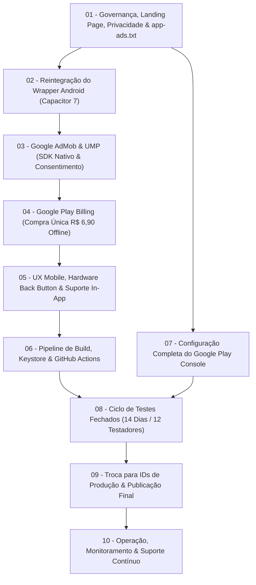

# PLAN_REVISION.md — Revisão Geral e Auditoria de Lançamento Comercial

> **Produto:** ToolOptimizer CNC  
> **Versão:** 2.0.0  
> **Data da Auditoria:** Setembro de 2026  
> **Responsável Técnico:** Antigravity AI Engine  
> **Status:** Aprovado para Execução  

---

## 1. Sumário Executivo: A Mudança de Paradigma

O planejamento inicial do projeto limitava-se a uma abordagem puramente de empacotamento de software: converter a Single Page Application (SPA) React existente em um aplicativo Android via wrapper Capacitor.

A auditoria do **Escopo 2** estabeleceu uma transição fundamental: **de um plano de empacotamento técnico para um plano de lançamento e operação de um produto comercial de engenharia**.

```
[Visão Anterior: Técnica/Limitada]
Código React/Vite ──> Capacitor Wrapper ──> Gerar .AAB ──> Subir na Play Store

[Nova Visão: Produto Comercial Completo]
┌──────────────────────────────────────────────────────────────────────────────────┐
│                             PRODUTO TOOLOPTIMIZER CNC                            │
├───────────────────────┬─────────────────────────┬────────────────────────────────┤
│      ENGENHARIA       │       COMERCIAL         │          OPERAÇÃO              │
│ • Motor Kienzle       │ • Google AdMob (GMA)    │ • Play Console (Conta PF)      │
│ • 100% Offline-First  │ • Play Billing (R$ 6,90)│ • 14 Dias / 12 Testadores      │
│ • 120 Testes Vitest   │ • UMP Consent (LGPD)    │ • Android Vitals (<1.09% crash)│
│ • IndexedDB Local     │ • app-ads.txt no Cloud  │ • Suporte (tooloptimizer@...)  │
│ • Zero Login/Cadastro │ • Zero Risco Acidental  │ • Landing & Privacidade Web    │
└───────────────────────┴─────────────────────────┴────────────────────────────────┘
```

Esta revisão analisa profundamente as 14 áreas de atuação necessárias, define a arquitetura definitiva do produto, estabelece o veredito sobre a desnecessidade de um painel administrativo com backend próprio e mapeia os bloqueadores críticos que definem a linha do tempo do lançamento.

---

## 2. Análise Profunda das 14 Áreas do Produto

### Área 1: Aplicação & Motor de Cálculo
* **Estado Atual:** 100% operacional. 120 testes automatizados passando no Vitest (`npm run check` verde). Motor Kienzle validado com tolerância de cálculo de $\pm 5\%$, abrangendo Fresamento, Furação, Roscamento e Mandrilamento.
* **Diagnóstico de Lacunas:** A aplicação está madura e estável. A lacuna existente é de integração com o ciclo de vida mobile (hibernação do app, retenção de estado ao alternar aplicativos e tratamento do botão físico de voltar).
* **Diretriz:** Nenhuma alteração no motor físico ou nos cálculos. O foco é manter a pureza das funções matemáticas e a integridade do banco de dados local IndexedDB (`tooloptimizer_db`).

### Área 2: Plataforma Android & Wrapper (Capacitor)
* **Estado Atual:** Código web preparado com layouts responsivos para desktop e mobile (`MobileCalculator.tsx`, `MobileStickyBar.tsx`, `MobileResultsSheet.tsx`). O wrapper Capacitor ainda não está integrado ao repositório.
* **Diagnóstico de Lacunas:** Falta a reintegração limpa do `@capacitor/core`, `@capacitor/android` e `@capacitor/cli` (versão 7 moderna), configuração do `capacitor.config.ts` com identificador de pacote oficial (`br.com.tooloptimizercnc.app`), geração da pasta nativa `android/` com Gradle 8+ e JDK 17, Target SDK 35 (obrigatório pelo Google em 2026), e implementação de tratamento do Hardware Back Button e Safe Areas.
* **Diretriz:** Manter a ponte nativa o mais enxuta possível, com sincronização automatizada dos assets gerados em `dist/`.

### Área 3: Google Play Store & Play Console
* **Estado Atual:** Conta de Desenvolvedor Pessoa Física (PF) já criada, taxa de US$ 25 paga, identidade verificada e conta aprovada pelo Google.
* **Diagnóstico de Lacunas:**
  * **Regra dos 14 Dias / 12 Testadores:** Como a conta é de Pessoa Física, o Google exige obrigatoriamente um ciclo de **Closed Testing** com no mínimo 12 testadores inscritos por 14 dias contínuos antes de liberar o botão de publicação para produção. Este é o maior bloqueador de calendário do projeto.
  * **Ficha da Loja (Store Listing):** Necessidade de título oficial, descrição curta (80 caracteres), descrição completa (4.000 caracteres com foco em ASO), ícone de alta resolução (512x512 PNG), imagem gráfica de destaque (Feature Graphic 1024x500 PNG) e screenshots reais de celular capturados no app Android.
  * **Conformidade de Conteúdo:** Preenchimento do questionário de classificação indicativa IARC (Livre para todas as idades / Utilidade / Ferramenta), declaração de segurança de dados (Data Safety Section) e declaração de público-alvo e anúncios.
  * **Configuração Financeira:** Habilitação do Perfil de Pagamentos (Merchant Account) no Play Console vinculado à conta bancária do desenvolvedor para recebimento das vendas in-app.

### Área 4: Publicidade (Google AdMob)
* **Estado Atual:** Pesquisa de viabilidade e arquitetura concluída (`MONETIZATION_RESEARCH.md`). Nenhuma conta AdMob configurada e nenhum código de anúncios inserido no app.
* **Diagnóstico de Lacunas:**
  * Criação da conta Google AdMob vinculada ao e-mail oficial `tooloptimizercnc@gmail.com`.
  * Criação do bloco de anúncio oficial (Adaptive Banner de topo).
  * Adoção do SDK oficial Google Mobile Ads (GMA) via plugin Capacitor nativo (`@capacitor-community/admob`). Proibição expressa de usar scripts web AdSense dentro do WebView (risco de banimento imediato).
  * Implementação do User Messaging Platform (UMP) SDK para gerenciar consentimento de privacidade (LGPD e GDPR).
  * Tratamento de falhas: se o dispositivo estiver sem internet, o AdMob falha silenciosamente sem exibir placeholders cinzas, sem travar a interface e sem poluir o cálculo.
  * Configuração do `app-ads.txt` no domínio web para validação de inventário do AdMob.

### Área 5: Compra In-App (Google Play Billing)
* **Estado Atual:** Decisão consolidada de oferecer produto in-app não-consumível com preço final único de **R$ 6,90** (sem menções promocionais) para remoção definitiva de anúncios.
* **Diagnóstico de Lacunas:**
  * Cadastro do SKU no Play Console: `br.com.tooloptimizercnc.remove_ads` com valor fixo de R$ 6,90.
  * Integração com a Google Play Billing Library via plugin Capacitor nativo.
  * **Validação e Restauração Sem Login:** O app consulta as compras ativas vinculadas à conta Google logada no smartphone Android (`queryPurchasesAsync`).
  * **Persistência Offline Local:** Após confirmar a compra ativa, o status é gravado no storage local do aparelho (IndexedDB/Preferences). O operador em modo offline continua com a experiência livre de anúncios.
  * Interface: Botão discreto nas Configurações (`SettingsView.tsx`) para compra e restauração manual se necessário.

### Área 6: Página Pública & Landing Page
* **Estado Atual:** Landing page institucional funcional localizada no diretório `landing/`, hospedada e publicada no Cloudflare Pages sob o domínio `www.tooloptimizercnc.com.br`.
* **Diagnóstico de Lacunas:**
  * Criação e publicação do arquivo `politica-de-privacidade.html` acessível publicamente via URL direta (exigência bloqueadora do Google Play).
  * Criação e publicação do arquivo `app-ads.txt` na raiz do domínio (`https://www.tooloptimizercnc.com.br/app-ads.txt`).
  * Atualização dos textos institucionais e canais de contato com o e-mail oficial `tooloptimizercnc@gmail.com`.
  * Inclusão do badge oficial da Google Play Store apontando para o link do app assim que for aprovado.
  * Seção de FAQ simples com dúvidas frequentes sobre parâmetros CNC, funcionamento offline e modelo de Kienzle.

### Área 7: Painel Administrativo (Investigação Detalhada)
* **A Pergunta da Auditoria:** O ToolOptimizer CNC necessita do desenvolvimento de um painel web administrativo proprietário com autenticação e backend?
* **Análise Detalhada das Demandas Operacionais:**
  1. *Gerenciamento de Usuários e Contas:* O app não possui contas, logins, senhas ou perfis na nuvem. Logo, um módulo de usuários em painel teria **zero** dados para gerenciar.
  2. *Gerenciamento de Ferramentas e Materiais:* Todas as bibliotecas de ferramentas, insertos, máquinas e coeficientes específicos de usinagem pertencem ao usuário e são mantidas localmente em seu aparelho via IndexedDB (`SettingsView.tsx`). Não há banco de dados centralizado para editar.
  3. *Métricas Financeiras e Compras:* O **Google Play Console** já fornece painel com relatórios detalhados de transações diárias, reembolsos, gráficos de conversão, conciliação tributária e repasses para a conta bancária do desenvolvedor.
  4. *Métricas de Publicidade:* O **Google AdMob Console** oferece painel de controle completo com impressões, eCPM por país, fill-rate, receita estimada, relatórios em tempo real e regras de bloqueio de anunciantes indesejados.
  5. *Monitoramento de Erros e Estabilidade:* O **Android Vitals** dentro do Play Console já registra falhas de inicialização, taxas de crash, ANRs (Application Not Responding) e impacto na bateria.
  6. *Métricas de Acesso Web:* O **Cloudflare Pages Analytics** já monitora visitas, países e requisições da landing page de forma nativa e sem cookies.
* **Veredito:** **NÃO DESENVOLVER PAINEL PRÓPRIO.**
  * Criar um painel web com backend agora traria custos mensais de servidores/banco de dados, introduziria superfícies de ataque para invasões, exigiria rotinas de backup na nuvem e criaria responsabilidades adicionais sob a LGPD.
  * A operação comercial completa do produto é realizada **com 100% de precisão e zero custo adicional** utilizando exclusivamente as ferramentas oficiais disponibilizadas pelo Google (Play Console, AdMob) e Cloudflare.

### Área 8: Segurança e Acessos Administrativos
* **Estado Atual:** Projeto em desenvolvimento local, sem repositórios públicos desprotegidos.
* **Diagnóstico de Lacunas:**
  * Implementação de Autenticação em Duas Etapas (2FA/MFA) com chave física ou app autenticador (Google Authenticator) na conta Google oficial do projeto (`tooloptimizercnc@gmail.com`) e na conta Cloudflare.
  * Geração e guarda redundante do par de chaves de assinatura do app Android (`upload-key.jks` / `.keystore`). A perda dessa chave impede o envio de atualizações para o Google Play.
  * Habilitação do serviço **Google Play App Signing**, garantindo que o Google mantenha a chave mestra de distribuição em seu cofre de segurança, permitindo a recuperação em caso de perda da chave de upload local.
  * Proteção do código-fonte: Proibição estrita de salvar senhas, chaves privadas ou tokens de API dentro do repositório Git.

### Área 9: Backend e Infraestrutura
* **Estado Atual:** Arquitetura 100% Client-Side. Todos os cálculos matemáticos rodam no JavaScript/WebAssembly do navegador ou do WebView nativo.
* **Diagnóstico de Lacunas:**
  * Nenhuma lacuna de backend. A ausência de backend é uma vantagem estratégica fundamental:
    * Custo de hospedagem e banco de dados: **R$ 0,00/mês**.
    * Tolerância a falhas: **Infinita** (o app não cai por instabilidade de servidor).
    * Desempenho: **Instantâneo** (sem latência de rede nos cálculos de Kienzle).
    * Conformidade LGPD: **Risco mínimo** (nenhum dado confidencial de clientes ou empresas trafega ou é armazenado em servidores).
  * Infraestrutura necessária limitada a recursos estáticos globais gratuitos (Cloudflare Pages com CDN mundial para a landing page, política de privacidade e `app-ads.txt`).

### Área 10: Privacidade, Termos e Conformidade Legal
* **Estado Atual:** Inexistência de documentos legais formais.
* **Diagnóstico de Lacunas:**
  * **Política de Privacidade Obrigatória:** Deve especificar com clareza:
    1. A aplicação não coleta dados pessoais identificáveis (nome, CPF, endereço).
    2. O uso do Google AdMob para exibição de anúncios e os identificadores de publicidade do Google (GAID).
    3. O uso do Google Play Billing para processamento de pagamentos.
    4. O armazenamento 100% local dos dados de usinagem e ferramentas no dispositivo do usuário via IndexedDB.
    5. O canal de contato do encarregado/desenvolvedor (`tooloptimizercnc@gmail.com`).
  * **Termos de Uso e Disclaimer de Responsabilidade Técnica de Usinagem:**
    * Documento jurídico fundamental para software industrial.
    * Cláusula explícita de isenção de responsabilidade: Os cálculos de velocidade de corte ($V_c$), rotação ($n$), avanço ($f$), potência consumida ($P_c$) e força de corte ($F_c$) são baseados no modelo teórico de Kienzle e em dados tabelados padrão.
    * O operador, preparador, ferramenteiro ou programador CNC é o responsável final exclusivo pela conferência da rigidez do conjunto peça-máquina-ferramenta, fixação e condições reais de usinagem antes da execução de qualquer comando em máquina-ferramenta.
    * O aplicativo e seus desenvolvedores não se responsabilizam por quebras de ferramentas, colisão de máquinas, descarte de peças ou danos materiais resultantes da aplicação prática direta dos parâmetros sugeridos.

### Área 11: Analytics, Métricas e Telemetria
* **Estado Atual:** Inexistente.
* **Diagnóstico de Lacunas:**
  * No App Android: Utilizar a telemetria nativa do **Android Vitals** via Play Console (sem necessidade de SDKs pesados ou intrusivos que aumentam o consumo de bateria e o tamanho do app).
  * Na Publicidade: Utilizar o dashboard nativo do **Google AdMob** para métricas de receita (eCPM, impressões, cliques, fill-rate).
  * Na Web/Landing Page: Utilizar o **Cloudflare Web Analytics** nativo (sem cookies, focado em privacidade, mede visitantes e visualizações sem violar a LGPD).
  * Avaliação de Firebase Analytics: Considerar apenas como melhoria pós-lançamento, caso haja necessidade de medir funis de uso avançados. No lançamento inicial, priorizar a leveza e a privacidade.

### Área 12: Monitoramento e Operação Contínua
* **Estado Atual:** Não documentado.
* **Diagnóstico de Lacunas:**
  * Estabelecimento de metas de qualidade com base nos limiares ruins (*Bad Behavior Thresholds*) do Google Play:
    * Taxa de Falhas (Crash Rate): Manter rigorosamente abaixo de **1,09%**.
    * Taxa de ANR (App Não Responde): Manter rigorosamente abaixo de **0,47%**.
  * **Proteção do IndexedDB em Atualizações:** Definição de procedimento rigoroso para que atualizações futuras do aplicativo (versão 2.0.1, 2.1.0, etc.) nunca executem `deleteDatabase` ou comandos destrutivos no banco de dados local `tooloptimizer_db`, garantindo que os materiais e ferramentas cadastradas pelo operador nunca sejam apagadas durante upgrades.

### Área 13: Suporte ao Usuário e Feedback
* **Estado Atual:** Não configurado.
* **Diagnóstico de Lacunas:**
  * Canal de suporte formal: `tooloptimizercnc@gmail.com`.
  * Criação de botão de fácil acesso dentro da interface do aplicativo (em `SettingsView.tsx`): "Ajuda & Suporte" / "Reportar Inconsistência", abrindo o cliente de e-mail padrão com assunto pré-formatado contendo a versão do app e do Android.
  * Criação de seção na landing page com perguntas frequentes e link direto para contato.
  * Procedimento de monitoramento diário das avaliações e reviews na Google Play Store, respondendo com cordialidade e precisão técnica.

### Área 14: Aquisição, Lançamento e Distribuição (ASO)
* **Estado Atual:** Nenhum trabalho de otimização de loja realizado.
* **Diagnóstico de Lacunas:**
  * Estratégia de ASO (App Store Optimization) em português brasileiro:
    * *Título:* ToolOptimizer CNC — Calculadora de Parâmetros de Usinagem
    * *Palavras-chave no texto:* Usinagem CNC, modelo de Kienzle, torneamento, fresamento, furação, avanço por dente ($f_z$), velocidade de corte ($V_c$), rotação ($RPM$), potência de usinagem, força de corte, ferramentas de corte, metalmecânica.
  * Estratégia de Lançamento Inicial: Divulgação em grupos de técnicos mecânicos, operadores CNC, programadores CAM (Mastercam, PowerMill, SolidCAM, NX) e comunidades do setor metalúrgico no WhatsApp, Telegram e LinkedIn.

---

## 3. Matriz de Riscos e Bloqueadores Reais

| Risco / Bloqueador | Gravidade | Probabilidade | Impacto no Projeto | Ação de Mitigação Planejada |
|---|:---:|:---:|---|---|
| **Exigência de 14 dias / 12 testadores** | `CRÍTICA` | `100%` | Atraso mínimo de 2 a 3 semanas na liberação para produção no Play Console. | Mapear e recrutar previamente lista de 15 a 20 pessoas de confiança; preparar guia de teste; iniciar a fase de Closed Testing o mais cedo possível. |
| **Rejeição por Política de Privacidade ausente ou incompleta** | `ALTA` | `ALTA` | Bloqueio imediato na análise inicial de submissão do Google. | Publicar `politica-de-privacidade.html` no domínio `www.tooloptimizercnc.com.br` antes de enviar o primeiro build para a loja. |
| **Cliques acidentais ou violação de layout AdMob** | `ALTA` | `MÉDIA` | Suspensão da conta AdMob ou bloqueio de pagamentos por tráfego inválido. | Posicionar o banner adaptativo de forma fixa no topo do layout, com espaçamento adequado dos seletores de parâmetros e sem cobrir áreas interativas. |
| **Perda da Chave de Assinatura (`.jks`)** | `CRÍTICA` | `BAIXA` | Impossibilidade permanente de atualizar o app na Play Store. | Ativar Play App Signing no console; armazenar o arquivo `.jks` em múltiplos backups seguros criptografados e como secrets no GitHub Actions. |
| **Corrupção de dados no IndexedDB em atualizações** | `MÉDIA` | `BAIXA` | Perda de ferramentas e materiais customizados cadastrados pelo usuário. | Criar suíte de testes de migração de schema no Vitest garantindo que novos releases apenas façam upgrades aditivos no IndexedDB. |

---

## 4. Estrutura Revisada das Etapas de Lançamento

Com base no diagnóstico do Escopo 2, o roteiro foi reorganizado e expandido para **10 etapas encadeadas**, cobrindo o produto da base de governança até a operação pós-lançamento:



### Síntese das 10 Etapas:

1. **Etapa 01 — Governança, Landing Page, Privacidade & `app-ads.txt`:** Publicação das páginas legais em `www.tooloptimizercnc.com.br`, arquivo `app-ads.txt`, atualização de e-mail e canais de contato, e inserção de disclaimer de usinagem.
2. **Etapa 02 — Reintegração do Wrapper Android (Capacitor 7):** Instalação do Capacitor 7, configuração do Gradle moderno, Target SDK 35, ícones e splash screen industriais.
3. **Etapa 03 — Google AdMob & UMP (SDK Nativo & Consentimento):** Integração do plugin `@capacitor-community/admob`, UMP SDK para LGPD/GDPR, banner de topo discreto e tratamento para falha silenciosa offline.
4. **Etapa 04 — Google Play Billing (Compra Única R$ 6,90 Offline):** Integração do plugin de In-App Purchase nativo para o SKU `remove_ads`, validação de compras sem login via Conta Google do dispositivo e persistência do status offline no armazenamento local.
5. **Etapa 05 — UX Mobile, Hardware Back Button & Suporte In-App:** Tratamento do botão voltar físico em modais e gavetas (`MobileResultsSheet`, `SettingsView`), safe areas de entalhe (notch) e link de suporte por e-mail no app.
6. **Etapa 06 — Pipeline de Build, Keystore & GitHub Actions:** Geração segura do `.keystore`/`.jks`, configuração de segredos criptografados no GitHub, e pipeline CI/CD para compilação automatizada do `.aab` de release.
7. **Etapa 07 — Configuração Completa do Google Play Console:** Ficha da loja (textos, screenshots, artes), Merchant Account, cadastro do produto `remove_ads` (R$ 6,90), IARC, Data Safety e vinculação de URLs.
8. **Etapa 08 — Ciclo de Testes Fechados (14 Dias / 12 Testadores):** Envio da versão release para a faixa de teste fechado, ativação dos 12+ testadores por 14 dias ininterruptos, telemetria de zero falhas e solicitação de acesso à produção.
9. **Etapa 09 — Troca para IDs de Produção & Publicação Final:** Atualização dos IDs de AdMob de teste para os oficiais de produção, compilação final do `.aab`, submissão para Produção e acompanhamento da aprovação do Google.
10. **Etapa 10 — Operação, Monitoramento & Suporte Contínuo:** Acompanhamento do Android Vitals (crashes e ANRs), monitoramento de receita no AdMob e Play Console, atendimento de suporte via e-mail e rotina de updates seguros sem perda de IndexedDB.
